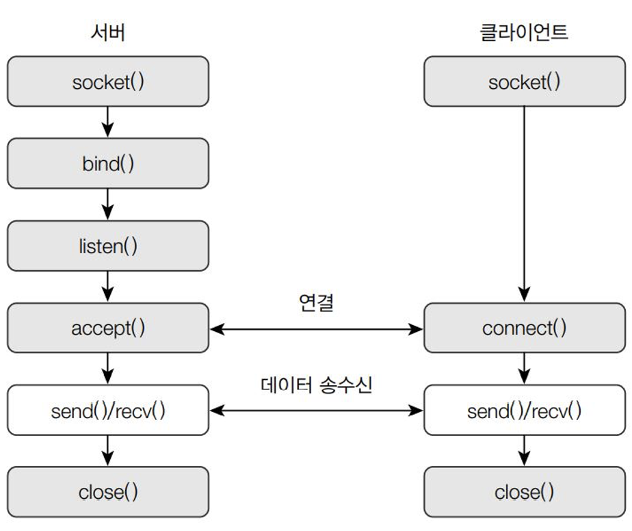

# 📊 통신

## 1️⃣ TCP와 UDP
### 🎯 TCP
- 연결 지향
- 신뢰성 보장
- 흐름 제어 기능
- 순서 보장

### 🎯 UDP 
- 비연결성
- 신뢰성 보장 X
- 흐름 제어 기능 부재
- 순서를 보장하지 않음

<br>
<br>


## 2️⃣ IP 주소와 포트 번호


### 🎯 IP 주소와 호스트명
1. IP 주소
    - 인터넷을 이용할 때 사용하는 주소 

2. 호스트명
    - IP 주소를 사람 이름처럼 이름을 지정하는 것
    - DNS : 호스트명과 도메인명을 관리하는 시스템

<br>


### 🎯 호스트명과 IP주소 읽어오기
1. **hostent류 함수들**
    ```
    #include <netdb.h>

    // 호스트명과 IP주소를 읽어 hostent 구조체에 저장 후 주소 반환
    struct hostent * gethosent(void);  

    // DB의 현재 읽기 위치를 시작 부분으로 재설정
    void sethostent(int stayopen);

    // 데이터베이스 닫기
    void endhostent();
    ```
2. **struct hostent 구조체**
    ```
    struct hostent {
        char *h_name;       // 호스트명
        char **h_aliases;   // 호스트를 가르키는 다른 이름들
        int h_addrtype;     // 호스트 주소 형식
        int h_length;       // 주소의 길이를 저장
        char **h_addr_list; // 호스트의 주소 목록
    }
    ```

3. **예제** : 호스트명 읽기
    ```
    #include <netdb.h>
    #include <stdio.h>

    int main() {
        struct hostent *ent;

        sethostent(0);

        while((ent = gethostent()) != NULL) {
            printf("Name = %s\n", ent->h_name);
        }

        endhostent();
    }
    ```

<br>


### 🎯 호스트명으로 정보 검색 : gethostbyname()
```
#include <netdb.h>

struct hostent *gethostbyname(const char *name);
```
- 호스트명을 인자로 받아 db에서 해당 항목을 검색해 hostent 구조체에 저장하고 그 주소를 반환

<br>


### 🎯 IP주소로 정보 검색 : gethostbyaddr()
```
#include <netdb.h>
#include <sys/socket.h>

struct hostent *gethostbyaddr(const void *addr, socklent_t len, int type);
```
- addr : 검색하려는 IP 주소
- len : addr 길이
- type : IP 주소 형식 (AF_UNIX, AF_INET)

<br>


### 🎯 포트 정보 읽어오기 : 
1. getservent(), setservent(), endservent()
    ```
    #include <netdb.h>

    // 포트 정보를 읽어서 servent 구조체에 저장하고 그 주소를 반환
    struct servent *getservent(void);   

    // db의 현재 읽기 위치를 시작 부분으로 재설정
    void setservent(int stayopen);

    // db 닫기
    void endservent(void);
    ```

2. servetn 구조체
    ```
    struct servent {
        char *s_name;       // 포트명
        char **s_aliases;   // 해당 서비스를 가르키는 다른 이름들
        int s_port;         // 포트 번호
        char *s_proto;      // 서비스에 사용되는 프로토콜 종류
    }
    ```

3. 예제 코드
    ```
    #include <netdb.h>
    #include <stdio.h>

    int main() {
        struct servent *port;
        int n;

        setservent(0);
        for(n = 0; n < 5; n++) {
            port = getservent();
            printf("Name : %s\n", port->s_name);
            printf("Port : %d\n", port->s_port);
        }
        endservent();
    }
    ```

<br>


### 🎯 서비스명으로 정보 검색 : getservbyname()
```
#include <netdb.h>

struct servent *getservbyname(const char *name, const char *proto);
```
- name : 검색할 포트 명
- proto : tcp, udp

<br>


### 🎯 포트 번호로 정보 검색 : getservbyport() 
```
#include <netdb.h>

struct servent *getservbyport(int port, const char *proto);
```
- port : 검색할 포트 번호
- proto : tcp, udp

<br>
<br>


## 3️⃣ 소켓 프로그래밍


### 🎯 소켓 주소 구조체
1. 유닉스 도메인 소켓
    ```
    struct aockaddr_un {
        _kernel_sa_family_t sun_family;     // AF_UNIX
        char sun_path[UNIX_PATH_MAX];       // 경로명
    }
    ```
2. 인터넷 소켓의 주소 구조체
    ```
    struct sockaddr_in {
        __kernel_sa_family_t sin_family;    // 주소 패밀리명
        __be15 sin_port;                    // 포트 번호
        sturct in_addr sin_addr;            // 인터넷 주소
    }
    struct in_addr {
        __be32 s_addr;  // 32bit 주소
    }
    ```

<br>


### 🎯 바이트 순서
- 인터넷으로 컴퓨터끼리 대화할 때 바이트 저장 순서는 중요하다.
- 이 혼란을 막기 위해 통신할 때에는 무조건 **빅 엔디안** 방법으로 통일했다.
1. 빅 엔디언
    - 각 바이트를 순서대로 저장
    - 0x1234 -> 0x12, 0x34
2. 리틀 엔디언
    - 각 바이트를 거꾸로 저장
    - 0x1234 -> 0x34, 0x12

```
#include <arpa/inet.h>

uint32_t htonl(uint32_t hostlong);      // 32비트 HBO -> NBO
uint16_t htons(uint16_t hostshort);     // 16비트 HBO -> NBO
uint32_t ntohl(uint32_5 netlong);       // 32비트 NBO -> HBO
uint16_t ntohs(uint16_t hostshort);     // 16비트 NBO -> HBO 
```

**예시 코드**
1. NBO -> HBO
    ```
    #include <stdio.h>
    #include <netdb.h>

    int main() {
        struct servent *port;
        int n;

        setservent(0);
        for(n = 0; n < 5; n++) {
            port = getservent();
            printf("Name : %s\n", port->s_name);
            printf("Port : %d\n", ntohs(port->s_port));
        }
        endservent();
    }
    ```
2. HBO -> NBO
    ```
    #include <netdb.h>
    #include <stdio.h>

    main() {
        struct servent *port;

        port = getservbyname("ssh", "tcp");
        printf("Name=%s, Port=%d\n", port->s_name, ntohs(port->s_port));

        port = getservbyport(htons(21), "tcp");
        printf("Name=%s, Port=%d\n", port->s_name, ntohs(port->s_port));

    }
    ```

<br>


### 🎯 문자열 IP 주소를 숫자로 변환 : inet_addr()
```
#include <sys/socket.h>
#include <netinet/in.h>
#include <arpa/inet.h>

in_addr_t inet_addr(const *ip_addr);
```
<br>

### 🎯 구조체 IP 주소를 문자열로 변환 : inet_ntoa()
```
#include <sys/socket.h>
#include <netinet/in.h>
#include <arpa/inet.h>

char *inet_ntoa(const struct in_addr in);
```
- in : 구조체 형태의 IP 주소

<br>
<br>


## 4️⃣ 소켓 인터페이스 함수

### 🎯 소켓 인터페잇 함수의 호출 순서 약도

<br>

### 🎯 소켓 인터페이스 함수 목록
```
socket() : 소켓 파일 기술자 생성 
bind() : 소켓 파일 기술자를 지정된 IP주소/포트와 결합
listen() : 클라이언트 연결 요청 대기 (서버)
connect() : 서버 접속 요청 (클라이언트)
accept() : 연결 요청 수락 (서버)
send() : 데이터 송신
recv() : 데이터 수신
sendto() : 데이터 송신
recvfrom() : 데이터 수신
close() : 소켓 파일 기술자 종료
```
<br>


### 🎯 소켓 파일 기술자 생성 : socket()
```
#include <sys/types.h>
#include <sys/socket.h>

int socket(int domain, int type, int protocol)
```
- domain : 소켓 종류 (AF_UNIX, AF_INET)
- type : 통신 방식 (SOCKET_STREAM, SOCK_DGRAM)
- protocol : 소켓에 이용할 프로토콜 

**[ 예제 코드 ]**
```
int sd;
sd = socket(AF_INET, SOCK_STREAM, 0);
```
<br>


### 🎯 소켓 파일 기술자를 지정된 IP 주소, 포트와 결합 : bind()
```
#include <sys/types.h>
#include <sys/socket.h>

int ind(int sockfd, const struct sockaddr *addr, socklen_t addrlen);
``` 
- sockfd : 소켓 기술자
- addr : 소켓 구조체
- addrlen : addr 크기

**[ 예제 코드 ]**
```
// IP주소를 192.168.100.1로 지정 & 포트 번호를 9000으로 지정

int sd;

struct sockaddr_in sin;
memset((char *)&sin, "\0", sizeof(sin));

sin.sin_family = AF_INET;
sin.sin_port = htons(9000);
sin.sin_addr.s_addr = inet_addr("192.168.100.1");

memset(&(sin.sin_zero), 0, 8);
bind(sd, (struct *)&sin, sizeof(struct sockaddr));
```
<br>


### 🎯 클라이언트 연결 요청 대기 : listen()
```
#include <sys/types.h>
#include <sys/socket.h>

int listen(int sockfd, int backlog);
```
- sockfd : 소켓 기술자
- backlog : 최대 허용 클라이언트 수

**[ 예시 코드 ]**
```
int sd = socket(AF_INET, SOCK_STREAM, 0);
listen(sd, 10);
```
<br>


### 🎯 클라이언트가 서버에 접속 요청 : connect()
```
#include <sys/types.h>
#include <sys/socket.h>

int connect(int sockfd, const struct sockaddr *addr, socklen_t addrlent);
```
- sockfd : 소켓 기술자
- addr : 서버 IP 정보
- addrlen : addr 크기

**[ 예제 코드 ]**
```
// IP 주소가 192.168.100.1인 서버에 9000번 포트로 연결 요청

int sd;
struct sockaddr_in sin;
memset((char *)&sin, '\0', sizeof(sin));

sin.sin_family = AF_INET;
sin.sin_prot = htons(9000);
sin.sin_addr.s_addr = inet_addr("192.168.100.1");
memset(&(sin.sin_zero), 0, 8);
connect(sd, (struct sockaddr*)&sin, sizeof(struct sockaddr));
```
<br>


### 🎯 클라이언트의 연결 요청 수락 : accept()
```
#include <sys/types.h>
#include <sys/socket.h>

int accept(int sockfd, struct sockaddr *addr, socklen_t *addrlen);
```
- sockfd : 소켓 기술자
- addr : 클라이언트 IP 정보
- addrlen : addr 크기

**[ 예시 코드 ]**
```
// 기존 소켓 기술자(sd)를 통해 연결이 수락되면 새로운 기술자 new_sd가 반환, clisindp zmffkdldjsxm wnthrk wjwkd

int sd, new_sd;
struct sockaddr_in sin, clisin;
new_sd = accept(sd, &clisin, &sizeof(struct sockaddr_in));
```
<br>


### 🎯 데이터 송신 1 : send()
```
#include <sys/types.h>
#include <sys/socket.h>

ssize_t send(int sockfd, cost void *buf, size_t len, int flags);
```
- sockfd : 소켓 기술자
- buf : 메시지를 저장할 메모리
- len : 메시지 크기
- flags : 데이터를 주고 받은 방법을 지정한 플래그

**[ 예시 코드 ]**
```
char *msg = "tralalero tralala";
send(fd, msg, sizeof(msg) + 1, 0);
```
<br>


### 🎯 데이터 송신 2 : sendto()
```
#include <sys/types.h>
#include <sys/socket.h>

ssize_t sendto( int sock_fd, 
                void *buf, 
                size_t len, 
                int flags, 
                const struct sockaddr *dest_addr, 
                socklen_t addrlen);
```
- sockfd : 소켓 기술자
- buf : 메모리 주소
- len : 메시지 크기
- flags : 데이터를 주고받는 방법을 지정한 플레그
- dest_addr : 메시지를 받을 호스트 주소
- addrlen : dest_addr 크기

**[ 코드 예시 ]**
```
char *msg = "Tralalalero Tralala";

struct sockaddr_in sin;
int size = sizeof(struct sockaddr_in);

memset((char*)&sin, '\0', sizeof(sin));
sin.sin_family = AF_INET;
sin.sin_port = htons(9000);
sin.sin_addr.s_addr = inet_addr("102.168.100.1");
memset(&(sin.sin_zero), 0, 8);
sendto(sd, msg, len, 0, &sin, size);
```
<br>


### 🎯 데이터 수신 1 : recv()
```
#include <sys/types.h>
#include <sys/socket.h>

ssize_t recv(int sockfd, void *buf, size_t len, int flg);
```
- sockfd : 소켓 기술자
- buf : 메시지를 저장할 메모리 주소
- len : buf 크기
- flg : 데이터를 주고받을 방법의 플래그

**[ 예시 코드 ]**
```
char buf[80];
int len, rlen;

rlen = recv(sd, buf, len, 0);
```
<br>


### 🎯 데이터 수신 2 : recvfrom()
```
#include <sys.types.h>
#include <sys/socket.h>

ssize_t recvfrom(   int sockfd,
                    void *buf,
                    size_t len,
                    int flags,
                    struct sockaddr *src_addr, 
                    socklen_t *addrlen
                    );
```
- sockfd : 소켓 기술자
- buf : 메모리 주소
- len : 메모리 크기
- flags : 데이터를 주고 받는 방법
- src_addr : 메시지를 보내는 호스트 주소
- addrlen : src_addr 크기

**[ 예시 코드 ]**
```
char buf[80];
int len, size;
struct sockaddr_in sin;

recvfrom(sd, buf, len, 0, &sin, &size);
```