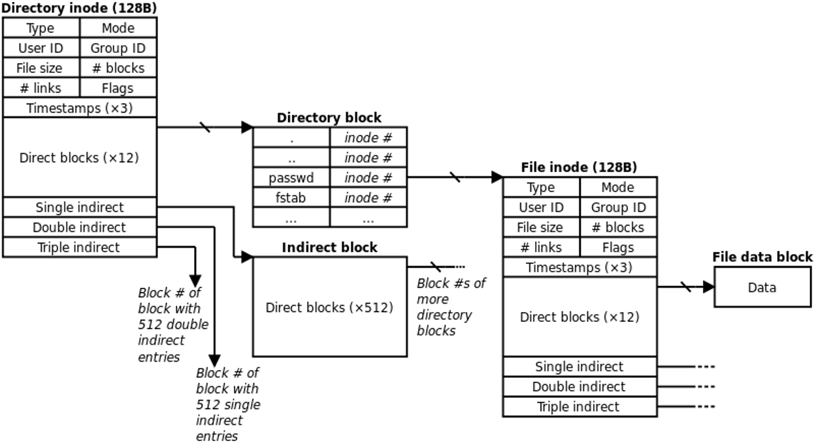
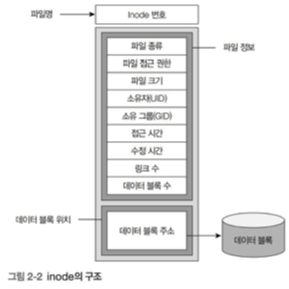
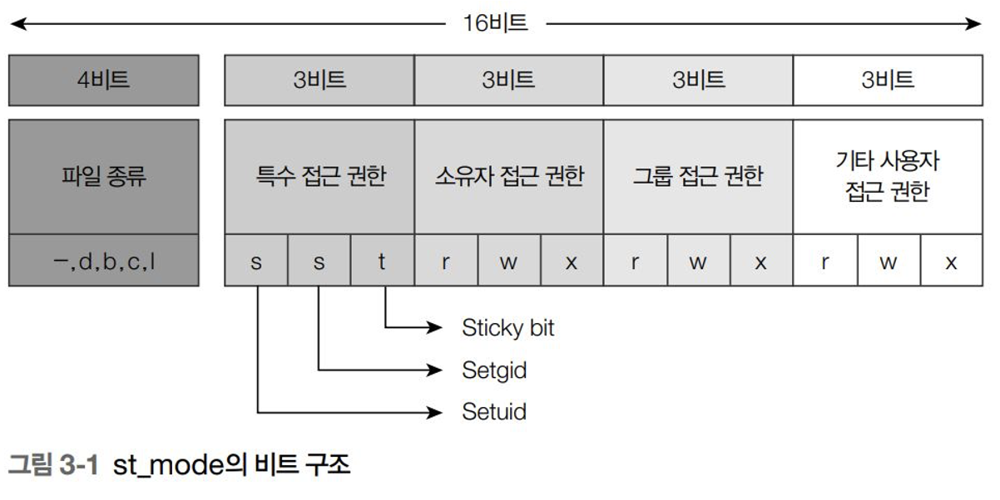

# 리눅스와 디렉터리

## 1️⃣ 리눅스 디렉터리

### 🎯리눅스의 파일 구분

리눅스에서는 파일을 다음과 같이 분류한다.
- 일반 파일
- 특수 파일
- 디렉터리

### 🎯 리눅스의 파일 구성
- 파일명 : 사용자가 파일에 접근할 때 사용
- Inode : 각종 파일 정보와 데이터 블록 주소들 등을 저장
- 데이터 블록 : 실제로 데이터가 저장되는 하드디스크 공간


<br>
---

## 2️⃣ 파일의 종류와 구성

### 🎯 리눅스 파일의 종류
#### **1. 일반 파일**
- 텍스트 파일, 실행 파일, 라이브러리 등 리눅스에서 사용하는 대부분의 파일
- 데이터 블록에 텍스트나 바이너리 형태의 데이터를 저장
- vi와 같은 편집기를 사용해 만들수도, 컴파일러나 다른 응용 프로그램에서 생성도 가능

#### **2. 특수 파일**
- 통신을 하거나 터미널, 디스크 등의 장치 사용할 때 이용하는 파일
- 장치의 종류를 나타내는 장치 번호를 inode에 저장
- 데이터 블록을 사용하지 않으며, 블록 장치 파일과 문자 장치 파일이 있음
    - 블록 장치 파일은 블록 단위로 데이터를 읽고 쓴다.
    - 문자 장치 파일은 하드 디스크인 경우 섹터 단위로 읽고 쓴다.

#### **3. 디렉터리**
- 리눅스에선 디렉터리도 파일로 취급
- 데이터 블록은 해당 이렉터리에 속한 파일 목록과 inode를 저장
<br>


### 🎯 리눅스 파일의 구성 요소
#### 1. 파일명
- 사용자가 파일에 접근 시 파일명과 관련된 inode가 필요로 함
- 파일명 지정 시 주의사항
    1. 파일명과 디렉터리명에 사용되는 알파벳은 대소문자를 구분
    2. 파일명과 디렉터리명이 '.'으로 시작되면 숨김 파일로 간주

#### 2. Inode
- 파일에 대한 정보를 저장하는 객체
- 디스크에 저장되어 있음

    
<br>
---

## 3️⃣ 디렉터리 명령어

### 🎯 mkdir
#### **1. 코드 예시**
```
#include <sys/stat.h>
#include <sys/types.h>

int mkdir(const char *pathname, mode_t mode);
```
- pathname : 디렉터리가 포함된 경로
- mode : 접근 권한

#### **2. mkdir 인자값와 반환값**
- 인자 : 생성하려는 디렉터리명을 포함한 경로, 기본 접근 권한
- 반환 : \
    0 : 수행 성공 \
    -1 : 실패 

#### **3. mkdir 예제**
```
#include <sys/stat.h>
#include <unistd.h>
#include <stdlib.h>
#include <stdio.h>

int main() {

    if (mkdir("testdir", 0755) == -1) {
            perror ("testdir");
            exit(1);
    }
}
```
<br>

### 🎯 rmdir
#### **1. 코드 예시**
```
#include <sys/stat.h>
#include <sys/types.h>

int rmdir(const char *pathname);
```
- pathname : 디렉터리가 포함된 경로

#### **2. rmdir 인자값와 반환값**
- 인자 : 생성하려는 디렉터리명을 포함한 경로
- 반환 : \
    0 : 수행 성공 \
    -1 : 실패 

#### **3. mkdir 예제**
```
#include <sys/stat.h>
#include <unistd.h>
#include <stdlib.h>
#include <stdio.h>

int main() {

    if (mkdir("testdir", 0755) == -1) {
            perror ("testdir");
            exit(1);
    }
}
```
<br>

### 🎯 getcwd
#### **1. getcwd 예제**
```
#include <sys/stat.h>

char *getcwd(char *buf, size_t size);
```
- buf : 현재 디렉터리의 절대경로를 저장할 버퍼주소
- size : 버퍼의 크기

#### **2. getcwd 인자값와 반환값**
- 인자 : 저장하려는 디렉터리명을 포함한 경로, 버퍼의 크기
- 반환 : 현재 dir

#### **3. getcwd 예제**
```
#include <unistd.h>
#include <stdlib.h>
#include <stdio.h>

int main() {
     char *cwd;
     char wd1[BUFSIZ];
     char wd2[64];

     getcwd(wd1, BUFSIZ);
     printf("wd1 = %s\n", wd1);

     cwd = getcwd(NULL, BUFSIZ);
     printf("cwd1 = %s\n", cwd);
     free(cwd);

     cwd = getcwd(NULL, 0);
     printf("cwd2 = %s\n", cwd);
     free(cwd);

     if(getcwd(wd2, 10) == NULL) {
         perror("getcwd");
         exit(1);
     }
}
/*
실행 결과 : 
wd1 = /home/jw/src/ch2
cwd1 = /home/jw/src/ch2
cwd2 = /home/jw/src/ch2
getcwd: Numerical result out of range
*/
```
- BUFSIZ는 stdio.h에서 8192(8kb)로 정의 되어있다.
<br>
<br>

### 🎯 get_current_dir_name
#### **1. getcwd 예제**
```
#include <unistd.h>

char *get_current_dir_name();
```

#### **2. getcwd 인자값와 반환값**
- 반환 : 현재 디렉터리의 절대 경로

#### **3. getcwd 예제**
```
#define _GNU_SOURCE
#include <unistd.h>
#include <stdlib.h>
#include <stdio.h>

int main() {
    char *cwd;

    cwd = get_current_dir_name();
    printf("cwd = %s\n", cwd);
    free(cwd);
}
/*
실행 결과 : 
cwd = /home/jw/src/ch2
*/
```
<br>

### 🎯 rename
#### **1. rename 예제**
```
#include <stido.h>

int rename(const char *oldpath, const char *newpath);
```

#### **2. rename 인자값와 반환값**
- 인자 : 
    - oldpath : 변경할 파일/디렉터리
    - newpath : 새 파일/디렉터리
- 반환 : 
    - 0 : 수행 성공
    - -1 : 수행 실패

- newpath가 빈값이면 oldpath를 삭제
- 오류 발생시 원본과 새로운 디렉터 모두 남음

#### **3. rename 예제**
```
#include <sys/stat.h>
#include <stdio.h>
#include <stdlib.h>

int main() {
     if(rename("oldname.txt", "newname.txt") == -1) {
         perror("Error renaming file");
         exit(1);
     }
}


```
<br>

### 🎯 chdir
#### **1. chdir 예제**
```
#include <unistd.h>

int chdir(const char *path);
```

#### **2. chdir 인자값와 반환값**
- 인자 : 
    - path : 이동하려는 디렉터리 경로
    - 상대경로, 절대경로 모두 사용 가능
- 반환 : 
    - 0 : 수행 성공
    - -1 : 수행 실패

#### **3. chdir 예제**
```
#include <unistd.h>
#include <stdio.h>
#include <stdlib.h>

int main() {
     char *cwd;

     cwd = getcwd(NULL, BUFSIZ);
     printf("1.Current Directory: %s\n", cwd);

     chdir("testdir");

     cwd = getcwd(NULL, BUFSIZ);
     printf("2.Current Directory: %s\n", cwd);

     free(cwd);
}
```
<br>

### 🎯 fchdir
#### **1. fchdir 예제**
```
#include <unistd.h>

int fchdir(int fd);
```

#### **2. fchdir 인자값와 반환값**
- 인자 : 
    - fd : 이동하려는 디렉터리의 파일 디스크립터
    - open() 함수로 해당 디렉터리의 디스크립터를 확인할 수 있다.
- 반환 : 
    - 0 : 수행 성공
    - -1 : 수행 실패

#### **3. fchdir 예제**
```
#include <fcntl.h>
#include <unistd.h>
#include <stdio.h>
#include <stdlib.h>

int main() {
     char *cwd;
     int fd;

     cwd = getcwd(NULL, BUFSIZ);
     printf("1.Current Directory: %s\n", cwd);

     fd = open("testdir", O_RDONLY);
     fchdir(fd);

     cwd = getcwd(NULL, BUFSIZ);
     printf("2.Current Directory: %s\n", cwd);

     close(fd);
     free(cwd);
}

```
<br>

### 🎯 그 외의 디렉터리 명령어
#### 1. opendir()
```
#include <sys/types.h>
#include <dirent.h>

DIR *opendir(const char *name);
```
#### 2. opendir()
```
#include <sys/types.h>
#include <dirent.h>

int closedir(DIR * dir);
```
#### 3. opendir()
```
#include <dirent.h>

struct dirent *readdir(DIR *dir);
```
<br>

---

## 4️⃣ Inode 상태 보기
### 🎯 Inode 다루기
#### 1. Inode 정보 검색
```
// 파일 정보 검색

int stat(const char *pathname, struct stat *statbuf);
int fstat(int fd, struct stat *statbuf);
```

#### 2. Inode 접근 권한 정보 확인
```
// 파일 접근 권한 확인
int access(const char *pathname, int mode);

// 파일 접근 권한 편경
int chmod(const cahr *pathname, mode_t mode);
int fchmod(int fd, mode_t mode);
```

#### 3. 링크 함수
- 링크 : 기존 파일이나 디렉터리에 접근할 수 있는 새로운 이름을 의미
```
// 하드 링크 생성
int link(const char *oldpath, const char *newpath);

// 심벌릭 링크 생성
int symlink(const char *target, const char *linkpath);

// 심벌릭 링크 정보 검색
int lstat(const char *pathname, struct stat *statbuf);

// 심벌릭 링크 내용 읽기
ssize_+_t readlink(const char *pathname, char *buf, size_t bufsize);

// 심벌릭 링크 원본 파일의 경로 검색
char *realpath(const char *path, char *resolved_path);

// 링크 끊기
int unlink(const char *pathname);
```

<br>

## 5️⃣ 파일 정보 검색

### 🎯 stat : 파일명으로 파일 정보 검색
#### **0. stat 구조체**
- stat() 함수는 검색한 inode 정보를 stat 구조체에 저장하여 반환한다
- <sys/stat.h> 헤더 파일을 포함
- stat.c 파일 참고

<br>

[ Stat 구조체의 구성 ]
- st_dev : 파일이 저장되어있는 장치의 번호
- st_ino : 파일의 inode 번호
- st_mode : 파일의 종류와 접근 권한
- st_nlink : 하드 링크의 개수
- st_uid : 파일 소유자의 UID
- st_gid : 파일 소유 그룹의 GID 
- st_rdev : 주 장치번호, 부 장치번호
- st_blksize : 파일 내용 입출력시 사용되는 버퍼 크기
- st_blocks : 파일에 할당된 파일 시스템 블록 수 (512 byte)
- timespec : 초, 나노초를 저장하기 위한 구조체
    ```
    struct timespec {
        _kernel_time_t tv_sec;  // 초
        long tc_nsec;           // 나노초
    }
    ```
- st_atime : 마지막으로 파일을 읽거나 실행한 시각 (timespec 구조체)
- st_mtime : 마지막으로 파일의 내용을 변경한 시각
- st_ctime : 마지막으로 inode의 내용을 변경한 시각

#### **1.  예제**
```
# include <sys/types.h>
# include <sys/stat.h>

int stat(const char *pathname, struct stat *statbuf);
```
- 파일에 이르는 경로의 각 디렉터리에 대한 읽기 권한 필요

#### **2. 인자값와 반환값**
- 인자 : 
    - pathname : 정보를 알고자하는 파일명
    - statbuf : 검색한 파일 정보를 저장할 구조체 주소
- 반환 : 
    - 0 : 성공
    - -1 : 실패

#### **3. 코드 예제**
```
#include <sys/types.h>
#include <sys/stat.h>
#include <unistd.h>
#include <stdio.h>

int main() {
     struct stat statbuf;

     stat("test.txt", &statbuf);

     printf("Inode = %d\n", (int)statbuf.st_ino);
     printf("Mode = %o\n", (unsigned int)statbuf.st_mode);
     printf("Nlink = %o\n",(unsigned int) statbuf.st_nlink);
     printf("UID = %d\n", (int)statbuf.st_uid);
     printf("GID = %d\n", (int)statbuf.st_gid);
     printf("SIZE = %d\n", (int)statbuf.st_size);
     printf("Blksize = %d\n", (int)statbuf.st_blksize);
     printf("Blocks = %d\n", (int)statbuf.st_blocks);

     printf("** timespec Style\n");
     printf("Atime = %d\n", (int)statbuf.st_atim.tv_sec);
     printf("Mtime = %d\n", (int)statbuf.st_mtim.tv_sec);
     printf("Ctime = %d\n", (int)statbuf.st_ctim.tv_sec);
     printf("** old Style\n");
     printf("Atime = %d\n", (int)statbuf.st_atime);
     printf("Mtime = %d\n", (int)statbuf.st_mtime);
     printf("Ctime = %d\n", (int)statbuf.st_ctime);
}
```
<br>

### 🎯 fstat : 파일명으로 파일 정보 검색
#### **1.  예제**
```
# include <sys/types.h>
# include <sys/stat.h>
# include <unistd.h>

int fstat(int fd, struct stat *statbuf);
```

#### **2. 인자값와 반환값**
- 인자 : 
    - fd : 열려있는 파일의 파일 기술자
    - statbuf : 검색한 파일 정보를 저장할 구조체 주소
- 반환 : 
    - 0 : 성공
    - -1 : 실패

#### **3. 코드 예제**
```
#include <sys/types.h>
#include <sys/stat.h>
#include <fcntl.h>
#include <unistd.h>
#include <stdlib.h>
#include <stdio.h>

int main() {
     int fd;
     struct stat statbuf;

     fd = open("test.txt", O_RDONLY);
     if (fd == -1) {
         perror("open: linux.txt");
         exit(1);
     }

     fstat(fd, &statbuf);

     printf("Inode = %d\n", (int)statbuf.st_ino);
     printf("UID = %d\n", (int)statbuf.st_uid);
     close(fd);
}

```
<br>

## 6️⃣ 파일 접근 권한 제어
### 🎯 st_mode의 구조

- st_mode 항목의 데이터형인 mode_t는 unsigned int로 정의 되어있다.
- 16 bit 

#### 1. 특수 접근 권한
    - 유효 사용자(그룹) 식별 번호 : 파일의 실제 소유권을 갖는 사용자의 식별번호
    - 진짜 사용자(그룹) 식별 번호 : 실제로 프로세스를 갖는 사용자의 식별번호

#### 2. 소유자/그룹/기타 사용자 접근 권한
- **set user-id** (04000) : 생성된 프로세스에게 그 프로세스를 시작시킨 사용자의 uid 대신 파일 소유자의 유효 사용자 식별번호를 부여
- **set group-id** (02000)
- **sticky bit** (01000) : 공유 디렉토리(/tmp)에 대한 접근 권한 or 텍스-이미지를 swap 영역에 남겨둠

### 🎯 파일 종류 검색
#### 1. 상수를 이용한 파일 종류 검색
| 상수명 | 상수값 | 기능 |
| :---: | :---: | :---: |
| S_IFMT | 0170000  | 파일의 종류 비트를 가져오기 위한 비트마스크 |
| S_IFSOCK | 0140000 | 소켓 파일 |
| S_IFLNK | 0120000 | 심벌릭 링크 파일 |
| S_IFREG | 0100000 | 일반 파일 |
| S_IFBLK | 0060000 | 블록 장치 특수 파일 |
| S_IFDIR | 0040000 | 디렉터리 |
| S_IFCHR | 0020000 | 문자 장치 특수 파일 |
| S_IFIFO | 0010000 | FIFO 파일 |

```
#include <sys/types.h>
#include <sys/stat.h>
#include <stdio.h>

int main() {
     struct stat statbuf;
     int kind;

     stat("test.txt", &statbuf);

     printf("Mode = %o\n", (unsigned int)statbuf.st_mode);

     kind = statbuf.st_mode & S_IFMT;
     printf("Kind = %o\n", kind);

     switch (kind) {
        case S_IFLNK:
          printf("test.txt: Symbolic Link\n");
          break;
        case S_IFDIR:
          printf("test.txt: Directory\n");
          break;
        case S_IFREG:
          printf("test.txt: Regular File\n");
          break;
     }
}
```

r:read

w:write

x:execute

7 -> rwx 전부 실행 가능(111)

6 -> rw만 실행 가능 (110)

0 -> 권한 x

`ls -al 파일명` 으로 확인 가능

#### 2. 매크로를 이용한 파일 종류 검색
| 매크로명 | 매크로 정의 | 기능 |
| :---: | :---: | :---: |
| S_ISLNK(m) | (((m)&S_IFMT) == S_IFLNK) | 참 : 심벌릭 링크 파일 |
| S_ISREG(m) | (((m)&S_IFMT) == S_IFEG) | 참 : 일반 파일 |
| S_ISDIR(m) | (((m)&S_IFMT) == S_IFDIR) | 참 : 디렉터리 |
| S_ISCHR(m) | (((m)&S_IFMT) == S_IFCHR) | 참 : 문자 장치 특수 파일 |
| S_ISBLK(m) | (((m)&S_IFMT) == S_IFBLK) | 참 : 블록 장치 특수 파일 |
| S_ISFIFO(m) | (((m)&S_IFMT) == S_IFIFO) | 참 : FIFO 파일 |
| S_ISSOCK(m) | (((m)&S_IFMT) == S_IFSOCK) | 참 : 소켓 파일 |

```
#include <unistd.h>
#include <stdio.h>
#include <stdlib.h>

int main() {
     char *cwd;

     cwd = getcwd(NULL, BUFSIZ);
     printf("1.Current Directory: %s\n", cwd);

     chdir("testdir");

     cwd = getcwd(NULL, BUFSIZ);
     printf("2.Current Directory: %s\n", cwd);

     free(cwd);
}
```
<br>

### 3. 상수를 이용한 파일 접근 권한 검색
- st_mode값을 왼쪽으로 3비트 이동시킨 후 and 연산을 수행하여 접근 권한 검색

    `st_mode & (S_IREAD >> 3)`

- shif 연산 대신 직접 and 연산으로도 할 수 있다
    | 매크로명 | 매크로 정의 | 기능 |
    | :---: | :---: | :---: |
    | S_IRWXU | 00700 | 소유자 읽기/쓰기/실행 |
    | S_IRUSR | 00400 | 소유자 읽기 |
    | S_IWUSR | 00200 | 소유자 쓰기 |
    | S_IXUSR | 00100 | 소유자 실행 |
    | S_IRWXG | 00070 | 그룹 읽기/쓰기/실행 |
    | S_IRGRP | 00040 | 그룹 읽기 |
    | S_IWGRP | 00020 | 그룹 쓰기 |
    | S_IXGRP | 00010 | 그룹 실행 |
    | S_IRWXO | 00007 | 기타 사용자 읽기/쓰기/실행 |
    | S_IROTH | 00004 | 기타 사용자 읽기 |
    | S_IWOTH | 00002 | 기타 사용자 쓰기 |
    | S_IXOTH | 00001 | 기타 사용자 실행 |

    ```
    #include <sys/types.h>
    #include <sys/stat.h>
    #include <stdio.h>

    int main() {
        struct stat statbuf;

        stat("test.txt", &statbuf);
            printf("Mode = %o\n", (unsigned int)statbuf.st_mode);

        if ((statbuf.st_mode & S_IREAD) != 0)
            printf("test.txt: User has a read permission\n");

        if ((statbuf.st_mode & (S_IREAD >> 3)) != 0)
            printf("test.txt: Group has a read permission\n");

        if ((statbuf.st_mode & S_IROTH) != 0)
            printf("test.txt: Other have a read permission\n");
    }
    ```
<br>

### 🎯 함수를 이용한 접근 권한 검색 : access
#### **1. 예제**
```
# include <unistd.h>

int access(const char *pathname, int mode);
```
- pathname에 있는 파일이 mode로 지정한 권한을 지니는지 확인
- 유효 사용자 ID가 아닌 실제 사용자 ID에 대한 접근 권한만 확인

#### **2. 인자값와 반환값**
- 인자 : 
    - pathname : 접근권한을 알고자하는 파일의 경로
    - mode : 접근 권한
        - R_OK : 읽기 권한 확인
        - W_OK : 쓰기 권한 확인
        - X_OK : 실행 권환 확인
        - F_OK : 파일이 존재하는지 확인
- 반환 : 
    - 0 : 성공
    - -1 : 실패

#### **3. 코드 예제**
```
#include <sys/types.h>
#include <sys/stat.h>
#include <sys/errno.h>
#include <unistd.h>
#include <stdio.h>

extern int errno;

int main() {

        int per;

        if (access("test.bak", F_OK) == -1 && errno == ENOENT)
                printf("test.bak : File not exist.\n");

        per = access("test.txt", R_OK);
        if (per == 0)
                printf("test.txt : Read permission is permitted.\n");
        else if (per == -1 && errno == EACCES)
                printf("test.txt : Read permission is not permitted.\n");

}
```

### 🎯 파일명으로 접근 권한 변경 : chmod
#### **1.  예제**
```
# include <sys/stat.h>

int chmod(const char *pathname, mode_t mode)
```
- 특수 접근 권한 변경시 S_ISUID, S_ISGID, S_ISVTX 사용
- 소유자/그룹/기타 사용자의 접근 권한을 변경시 상수 사용

#### **2. 인자값와 반환값**
- 인자 : 
    - pathname : 접근 권한을 변경하려는 파일 경로
    - mode : 접근 권한 파일의 접근 권한을 검색할 수 있는 시스템 호출
- 반환 : 
    - 0 : 성공
    - -1 : 실패

#### **3. 코드 예제**
```
# 접근 권한 변경
chmod(pathname, S_IRWXU);
chmod(pathname, S_IRWXU | S_IRGRP | S_IXGRP | X_IROTH);

# 기존 권한 변경
mode |= S_IWGRP;

# 접근 권한 제거
mode &= ~(S_IORTH);

# mode값을 변경한 후 chmod() 함수를 호출해야 변경된 접근 권한이 적용됨
chmod(pathname, mode);
```

```
#include <sys/types.h>
#include <sys/stat.h>
#include <stdio.h>

int main() {
    struct stat statbuf;

    chmod("test.txt", S_IRWXU|S_IRGRP|S_IXGRP|S_IROTH);

    stat("test.txt", &statbuf);
    printf("1.Mode = %o\n", (unsigned int)statbuf.st_mode);

    statbuf.st_mode |= S_IWGRP;
    statbuf.st_mode &= ~(S_IROTH);

    chmod("test.txt", statbuf.st_mode);

    stat("test.txt", &statbuf);
    printf("2.Mode = %o\n", (unsigned int)statbuf.st_mode);
}
```

### 🎯 파일기술자로 접근 권한 변경 : fchmod
#### **1.  예제**
```
# include <sys/stat.h>

int fchmod(int fd, mode_t mode);
```
- 열려있는 파일의 파일 기술자를 받아 접근 권한을 변경

#### **2. 인자값와 반환값**
- 인자 : 
    - fd : 열려있는 파일의 파일 기술자
    - mode : 접근 권한
- 반환 : 
    - 0 : 성공
    - -1 : 실패

---
```
이거 무엇
ls -al test.txt
ls -al > test.txt
ls -al >>> test.txt

*** 시험 내용!!! ***
ls -al > sample.txt
ls -al sample.txt
chmod u+x, g+w, o+w sample.txt <- 파일 권한 변경
chmod g-w, o-w sample.txt
chmod 0640 sample.txt <- 다른 방법으로 권한 바꾸기

chmod u+s sample.txt <- 
chmod u-x sample.txt
ls -al sample.txt <- s가 대문자로 바뀌었을 것

chmod g+s sample.txt
ls -al sample.txt <- 대문자 S가 추가되었을 것
chmod o+t sample.txt 
ls -al sample.txt <- 대문자 T가 추가되었을 것
chmod o+x sample.txt
ls -al sample.txt <- 소문자 t로 바뀌었을 것
chmod 7644 sample.txt 
ls -al sample.txt <- 모든 특수 권한이 바뀌었을 것
```
