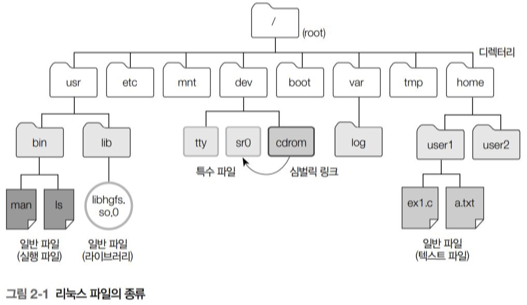

# 리눅스와 디렉터리

## 1️⃣ 리눅스 디렉터리

### 🎯리눅스의 파일 구분

리눅스에서는 파일을 다음과 같이 분류한다.
- 일반 파일
- 특수 파일
- 디렉터리

### 🎯 리눅스의 파일 구성
- 파일명 : 사용자가 파일에 접근할 때 사용
- Inode : 각종 파일 정보와 데이터 블록 주소들 등을 저장
- 데이터 블록 : 실제로 데이터가 저장되는 하드디스크 공간


<br>
---

## 2️⃣ 파일의 종류와 구성

### 🎯 리눅스 파일의 종류
#### **1. 일반 파일**
- 텍스트 파일, 실행 파일, 라이브러리 등 리눅스에서 사용하는 대부분의 파일
- 데이터 블록에 텍스트나 바이너리 형태의 데이터를 저장
- vi와 같은 편집기를 사용해 만들수도, 컴파일러나 다른 응용 프로그램에서 생성도 가능

#### **2. 특수 파일**
- 통신을 하거나 터미널, 디스크 등의 장치 사용할 때 이용하는 파일
- 장치의 종류를 나타내는 장치 번호를 inode에 저장
- 데이터 블록을 사용하지 않으며, 블록 장치 파일과 문자 장치 파일이 있음
    - 블록 장치 파일은 블록 단위로 데이터를 읽고 쓴다.
    - 문자 장치 파일은 하드 디스크인 경우 섹터 단위로 읽고 쓴다.

#### **3. 디렉터리**
- 리눅스에선 디렉터리도 파일로 취급
- 데이터 블록은 해당 이렉터리에 속한 파일 목록과 inode를 저장
<br>


### 🎯 리눅스 파일의 구성 요소
#### 파일명
- 사용자가 파일에 접근 시 파일명과 관련된 inode가 필요로 함
- 파일명 지정 시 주의사항
    1. 파일명과 디렉터리명에 사용되는 알파벳은 대소문자를 구분
    2. 파일명과 디렉터리명이 '.'으로 시작되면 숨김 파일로 간주

#### Inode
- 파일에 대한 정보를 저장하는 객체
- 디스크에 저장되어 있음

<br>
---

## 3️⃣ 디렉터리 명령어

### 🎯 mkdir
#### **1. 코드 예시**
```
#include <sys/stat.h>
#include <sys/types.h>

int mkdir(const char *pathname, mode_t mode);
```
- pathname : 디렉터리가 포함된 경로
- mode : 접근 권한

#### **2. mkdir 인자값와 반환값**
- 인자 : 생성하려는 디렉터리명을 포함한 경로, 기본 접근 권한
- 반환 : \
    0 : 수행 성공 \
    -1 : 실패 

#### **3. mkdir 예제**
```
#include <sys/stat.h>
#include <unistd.h>
#include <stdlib.h>
#include <stdio.h>

int main() {

    if (mkdir("testdir", 0755) == -1) {
            perror ("testdir");
            exit(1);
    }
}
```
<br>

### 🎯 rmdir
#### **1. 코드 예시**
```
#include <sys/stat.h>
#include <sys/types.h>

int rmdir(const char *pathname);
```
- pathname : 디렉터리가 포함된 경로

#### **2. rmdir 인자값와 반환값**
- 인자 : 생성하려는 디렉터리명을 포함한 경로
- 반환 : \
    0 : 수행 성공 \
    -1 : 실패 

#### **3. mkdir 예제**
```
#include <sys/stat.h>
#include <unistd.h>
#include <stdlib.h>
#include <stdio.h>

int main() {

    if (mkdir("testdir", 0755) == -1) {
            perror ("testdir");
            exit(1);
    }
}
```
<br>

### 🎯 getcwd
#### **1. getcwd 예제**
```
#include <sys/stat.h>

char *getcwd(char *buf, size_t size);
```
- buf : 현재 디렉터리의 절대경로를 저장할 버퍼주소
- size : 버퍼의 크기

#### **2. getcwd 인자값와 반환값**
- 인자 : 저장하려는 디렉터리명을 포함한 경로, 버퍼의 크기
- 반환 : 현재 dir

#### **3. getcwd 예제**
```
#include <unistd.h>
#include <stdlib.h>
#include <stdio.h>

int main() {
     char *cwd;
     char wd1[BUFSIZ];
     char wd2[64];

     getcwd(wd1, BUFSIZ);
     printf("wd1 = %s\n", wd1);

     cwd = getcwd(NULL, BUFSIZ);
     printf("cwd1 = %s\n", cwd);
     free(cwd);

     cwd = getcwd(NULL, 0);
     printf("cwd2 = %s\n", cwd);
     free(cwd);

     if(getcwd(wd2, 10) == NULL) {
         perror("getcwd");
         exit(1);
     }
}
/*
실행 결과 : 
wd1 = /home/jw/src/ch2
cwd1 = /home/jw/src/ch2
cwd2 = /home/jw/src/ch2
getcwd: Numerical result out of range
*/
```
- BUFSIZ는 stdio.h에서 8192(8kb)로 정의 되어있다.
<br>

### 🎯 get_current_dir_name
#### **1. getcwd 예제**
```
#include <unistd.h>

char *get_current_dir_name();
```

#### **2. getcwd 인자값와 반환값**
- 반환 : 현재 디렉터리의 절대 경로

#### **3. getcwd 예제**
```
#define _GNU_SOURCE
#include <unistd.h>
#include <stdlib.h>
#include <stdio.h>

int main() {
    char *cwd;

    cwd = get_current_dir_name();
    printf("cwd = %s\n", cwd);
    free(cwd);
}
/*
실행 결과 : 
cwd = /home/jw/src/ch2
*/
```
<br>

### 🎯 rename
#### **1. rename 예제**
```
#include <stido.h>

int rename(const char *oldpath, const char *newpath);
```

#### **2. rename 인자값와 반환값**
- 인자 : 
    - oldpath : 변경할 파일/디렉터리
    - newpath : 새 파일/디렉터리
- 반환 : 
    - 0 : 수행 성공
    - -1 : 수행 실패

- newpath가 빈값이면 oldpath를 삭제
- 오류 발생시 원본과 새로운 디렉터 모두 남음

#### **3. rename 예제**
```
#include <sys/stat.h>
#include <stdio.h>
#include <stdlib.h>

int main() {
     if(rename("oldname.txt", "newname.txt") == -1) {
         perror("Error renaming file");
         exit(1);
     }
}


```
<br>

### 🎯 chdir
#### **1. chdir 예제**
```
#include <unistd.h>

int chdir(const char *path);
```

#### **2. chdir 인자값와 반환값**
- 인자 : 
    - path : 이동하려는 디렉터리 경로
    - 상대경로, 절대경로 모두 사용 가능
- 반환 : 
    - 0 : 수행 성공
    - -1 : 수행 실패

#### **3. chdir 예제**
```
#include <unistd.h>
#include <stdio.h>
#include <stdlib.h>

int main() {
     char *cwd;

     cwd = getcwd(NULL, BUFSIZ);
     printf("1.Current Directory: %s\n", cwd);

     chdir("testdir");

     cwd = getcwd(NULL, BUFSIZ);
     printf("2.Current Directory: %s\n", cwd);

     free(cwd);
}
```
<br>

### 🎯 fchdir
#### **1. fchdir 예제**
```
#include <unistd.h>

int fchdir(int fd);
```

#### **2. fchdir 인자값와 반환값**
- 인자 : 
    - fd : 이동하려는 디렉터리의 파일 디스크립터
    - open() 함수로 해당 디렉터리의 디스크립터를 확인할 수 있다.
- 반환 : 
    - 0 : 수행 성공
    - -1 : 수행 실패

#### **3. fchdir 예제**
```
#include <fcntl.h>
#include <unistd.h>
#include <stdio.h>
#include <stdlib.h>

int main() {
     char *cwd;
     int fd;

     cwd = getcwd(NULL, BUFSIZ);
     printf("1.Current Directory: %s\n", cwd);

     fd = open("testdir", O_RDONLY);
     fchdir(fd);

     cwd = getcwd(NULL, BUFSIZ);
     printf("2.Current Directory: %s\n", cwd);

     close(fd);
     free(cwd);
}

```
<br>

### 🎯 그 외의 디렉터리 명령어
#### 1. opendir()
```
#include <sys/types.h>
#include <dirent.h>

DIR *opendir(const char *name);
```
#### 2. opendir()
```
#include <sys/types.h>
#include <dirent.h>

int closedir(DIR * dir);
```
#### 3. opendir()
```
#include <dirent.h>

struct dirent *readdir(DIR *dir);
```
