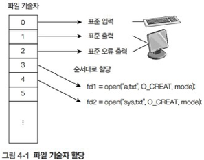

# 📝 링크
## 1️⃣ 링크 vs 심벌릭 링크
### 🎯 하드 링크
- 파일에 접근할 수 있는 파일명을 생성
- inode 사용
- 하드 링크 생성시 inode에 저장된 링크 수 증가

### 🎯 심벌릭 링크
- 기존 파일에 접근할 수 있는 파일
- 기존 파일과 다른 inode tkdyd
- 기존 파일의 경로를 저장

<br>

## 2️⃣ 링크 관련 명령어
### 🎯 하드 링크 생성 : link()
#### **1. 코드**
```
# include <unistd.h>

int link(const char *oldpath ,const char *newpath);
```
- 하드 링크를 생성할 때 사용
- 구 경로, 신 경로 둘 다 같은 파일 시스템으로 지정해야 함

#### **2. 코드 예시**
```
// ex_1.c

#include <sys/types.h>
#include <sys/stat.h>
#include <sys/errno.h>
#include <unistd.h>
#include <stdio.h>

extern int errno;

main() {
        struct stat buf;

        stat("test.txt", &buf);
        printf("Before Link Count = %d\n", (int)buf.st_nlink);

        link("test.txt", "test.ln");

        stat("test.txt", &buf);
        printf("After Link Count = %d\n", (int)buf.st_nlink);
}
```
<br>

### 🎯 심벌릭 링크 생성 : symlink()
#### **1. 코드**
```
# include <unistd.h>

int symlink(const char *target, const char *linkpath);
```
- target : 기존 파일 경로
- linkpath : 새로 생성할 심벌릭 링크 경로

- 심벌릭 링크는 기존 파일과 다른 파일 시스템에도 생성 가능

#### **2. 코드 예시**
```
// ex_2.c

#include <sys/types.h>
#include <sys/stat.h>
#include <sys/errno.h>
#include <unistd.h>
#include <stdio.h>

main() {
        symlink("test.txt", "test.sym");
}
```
<br>

### 🎯 심벌릭 링크의 정보 검색 : lstat()

#### **1. 코드**
```
# include <sys/types.h>
# include <sys/stat.h>
# include <unistd.h>

int lstat(const char *pathname, struct stat *statbuf);
```
- pathname : 심벌릭 링크 경로
- statbuf : 새로 생성할 링크의 경로

- 심벌릭 링크를 stat()로 검색시 원본 파일에 대한 정보가 검색된다는 점에 주의할 것

#### **2. 코드 예시**
```
// ex_3.c

#include <sys/types.h>
#include <sys/stat.h>
#include <sys/errno.h>
#include <unistd.h>
#include <stdio.h>

main() {

        struct stat buf;

        printf("1. stat : test.txt ---\n");
        stat("test.txt", &buf);
        printf("test.txt : Link Count = %d\n", (int)buf.st_nlink);
        printf("test.txt : Inode = %d\n", (int)buf.st_ino);

        printf("2. stat : test.sym ---\n");
        stat("test.sym", &buf);
        printf("test.sym : Link Count = %d\n", (int)buf.st_nlink);
        printf("test.sym : Inode = %d\n", (int)buf.st_ino);

        printf("3. lstat : test.sym ---\n");
        lstat("test.sym", &buf);
        printf("test.sym : Link Count = %d\n", (int)buf.st_nlink);
        printf("test.sym : Inode = %d\n", (int)buf.st_ino);

}
```

<br>

### 🎯 심벌릭 링크의 내용 읽기 : readlink()

#### **1. 코드**
```
# include <unistd.h>

ssize_t readlink(const char *pathname, char *buf, size_t bufsiz);
```
- pathname : 심벌릭 링크 경로
- buf : 읽어온 내용을 저장할 버퍼
- bufsiz : 버퍼 크기

#### **2. 코드 예시**
```
// ex_4.c

#include <sys/types.h>
#include <sys/stat.h>
#include <sys/errno.h>
#include <unistd.h>
#include <stdio.h>
#include <fcntl.h>
#include <stdlib.h>

main() {

        char buf1[BUFSIZ], buf2[BUFSIZ];
        int n;

        n = readlink("test.sym", buf1, BUFSIZ);
        if (n == -1) {
                perror("readlink");
                exit(1);
        }

        buf1[n] = '\0';
        printf("test.sym : READLINK = %s\n", buf1);

        realpath("test.sym", buf2);
	printf("test.sym : REALPATH = %s\n", buf2);

}
```


### 🎯 심벌릭 링크 원본 파일의 경로 읽기 : realpath()

#### **1. 코드**
```
# include <limits.h>
# include <stdlib.h>

char *realpath(const char *path, char *resolved_path);
```
- path : 심벌릭 링크의 경로명
- resolved_path : 경로명을 저장할 버퍼 주소

#### **2. 코드 예시**
```
// ex_5.c

# include <sys/stat.h>
# include <stdlib.h>
# include <stdio.h>

int main() {
    char buf[BUFSIZ];

    realpath("linux.sym", buf);
    printf("Real path : %s", buf);
}
```


### 🎯 링크 끊기 : unlink()

#### **1. 코드**
```
# include <unistd.h>

int unlink(const char *pathname);
```
- pathname : 삭제할 링크의 경로

#### **2. 코드 예시**
```
// ex_6.c

#include <sys/stat.h>
#include <unistd.h>
#include <stdio.h>

int main() {
    struct stat statbuf;

    stat("linux.ln", &statbuf);
    printf("1.linux.ln : Link Count = %d\n", (int)statbuf.st_nlink);

    unlink("linux.ln");

    stat("linux.txt", &statbuf);
    printf("2.linux.txt: Link Count = %d\n", (int)statbuf.st_nlink);

    unlink("linux.sym");
}
```
<br>
<br>

---

# 📝 파일 입출력
## 0️⃣ 저수준 입출력과 고수준 입출력의 비교
|  | 저수준 입출력 | 고수준 입출력 |
| :---: | :---: | :---: |
| 파일 지시자 | int fd | FILE *fp |
| 특징 | - 훨씬 빠름 <br> - 바이트 탄위 읽/쓰기 <br> - 특수 파일 접근 가능 | - 훨씬 쉬움 <br> - 버퍼 단위 읽/쓰기 <br> - 여러 형식 지원 |
| 주요 함수| open(), close(), read() 등 | fopen(), fclose(), fread() 등 |


## 1️⃣ 파일 기술자
- 열려있는 파일을 구분할 목적으로 시스템에서 붙여놓은 번호
- 저수준 파일 입출력에서는 열린 파일을 참조하는데 사용하는 지시자 역할 수행
- 파일 기술자는 정수값
- open()를 사용해 파일을 열 때 부여
- 프로세스가 파일을 열 때 0번부터 순서대로 부여

    - 0 : 표준 입력
    - 1 : 표준 출력
    - 2 : 표준 오류 출력
    - 3부터 파일 기술자가 할당됨


## 2️⃣ 고수준 파일 입출력
- 저수준 파일 입출력의 불편함 해서
- C 언어 표준함수 제공 
- 버퍼를 이용한 한 번에 읽기 & 쓰기 가능
- 자료형에 따라 편리하게 시용
- 열린 파일 참조

(실행 코드는 시험에 별로 나오지 않을 것)

## 3️⃣ 저수준 파일 입출력
- 리눅스 커널의 시스템 호출을 이용하여 파일 입출력을 실행
- 시스템 호출을 이용하여 파일에 좀 더 빠르게 접근
- 바이트 단위로 파일을 다룸 
    - 특수 파일 읽고 쓰기 가능
- 응용프로그램 작성 시 다른 추가기능을 함수로 추가 구현 필요
- 열린 파일 참조시 파일 기술자 사용

<br>

### 🎯 open()
#### **1. 코드**
```
# include <sys/stat.h>
# include <sys/types.h>
# include <fcntl.h>

int open(const char *pathname, int flags, mode_t mode);
```
- pathname에 지정한 파일을 lags에 지정한 상태 플래그의 값에 따라 열고 파일 기술자를 반환
- 파일 상태를 조정하는 flags값들은 `man`으로 확인 가능

#### **2. open 인자값와 반환값**
- 인자 : 
    - pathname : 디렉터리가 포함된 경로
    - flags : 파일 상태 플래그
    - mode : 접근 권한
- 반환 : 
    - 0 : 수행 성공 
    - -1 : 실패 

#### **3. open() 주요 flag**
| 종류 | 기능 |
| :---: | :---: |
| O_RDONLY | - 파일을 읽기 전용으로 열기 |
| O_WRONLY | - 파일을 쓰기 전용으로 열기 |
| O_RDWR | - 파일을 읽기/쓰기로 열기 |
| O_CREAT | - 파일 생성 |
| O_EXCL | - 기존에 없는 파일 생성 <br> - 있을 시 오류 메시지 출력 <br> - O_CREAT와 함께 사용 |
| O_APPEND | - 파일 맨 끝에 내용을 추가 |
| O_TRUNC | - 파일 쓰기 옵션으로 열 때 기존 내용 지우기 <br> - O_CREAT와 함께 사용 |
| O_SYNC <br> O_DSYNC | - 파일 쓰기 실행 시 저장장치에 쓰기를 마쳐야 동작을 완료 |

- O_EXCL과 O_TRUNC는 O_CREAT와 함께 사용함에 주의!

#### **4. 플래그 지정**
1. 이미 있는 파일을 쓰기 전용으로 열기

    ```O_WRONLY | O_TRUNC ```

2. 없는 파일을 쓰기 전용으로 열기

    ```O_WRONLY | O_CREAT | O_TRUNC```

3. 읽기 / 쓰기 / 추가용으로 열 때 

    ```O_RDWR | O_APPEND```

4. 상수를 이용해 0644 권한 지정

    ```mode = S_IRUSR | S_IWGRO | S_IROTH```

#### **5. 코드 예시**
```
// ex_7.c

# include <sys/types.h>
# include <sys/stat.h>
# include <fcntl.h>
# include <unistd.h>
# include <stdlib.h>
# include <stdio.h>

int main() {
    int fd;
    mode_t mode;

    mode = S_IRUSR | S_IWUSR | S_IRGRP | S_IROTH;

    fd = open("test.txt", O_CREAT, mode);
    if (fd == -1) {
        perror("Create");
        exit(1);
    }
    closed(fd);
}
```

<br>

### 🎯 creat()
#### **[ 1. 코드 예시 ]**
```
# include <sys/types.h>
# include <sys/stat.h>
# include <fcntl.h>

int creat(const char *pathname, mode_t mode);
```

- open()과 달리 플래그 지정 X
- 파일 생성시 파일 기술자가 반환됨 -> 파일을 열 때 open() 필요 없음
- `creat(pathname, mode)`와 `open(pathname, O_CREAT | O_WRONLY | O_TRUNC, mode)`는 같은 코드

#### **[ 2. open 인자값와 반환값 ]**
- 인자값 :
    - pathname : 파일 생성 경로
    - mode : 접근 권한

test1.c -> test.txt파일이 이미 있으면 오류 발생

### 🎯 close()
#### **[ 1. 코드 예시 ]**
```
# include <unistd.h>

int close(int fd);
```

#### **[ 2. close 인자값과 반환값 ]**
- 인자값 : 
    - fd : 파일 기술자
- 반환값 :
    - 0 : 성공적인 파일 닫기
    - -1 : 파일 닫기에 실패

#### **[ 3. close() 예시 코드 ]**
```
// ex_8.c

# include <sys/types.h>
# include <sys/stat.h>
# include <fcntl.h>
# include <unistd.h>
# include <stdlib.h>
# include <stdio.h>

int main() {
    int fd;

    fd = open("test.txt", O_CREAT | O_EXCL);
    if (fd == -1) {
        perror("Create");
        exit(1);
    }
    close(fd);
}
```
### 🎯 read()
#### **[ 1. 코드 ]**
```
# include <unistd.h>

ssize_t read(int fd, void *buf, size_t count);
```

#### **[ 2. 특징 ]**
- 인자값 : 
    - fd : 파일 기술자
    - buf : 파일에 기록할 데이터를 저장한 메모리 영역
    - count : buf의 크기(기록할 데이터 크기 : byte 단위)
- 함수 특징
    - 파일 기술자가 가르키는 파일에서 count 만큼 읽어 buf에 저장
    - 파일 유형에 상관없이 바이트 단위로 읽음

#### **[ 3. 코드 예시]**
```
// ex_9.c

# include <fcntl.h>
# include <unistd.h>
# include <stdlib.h>
# include <stdio.h>

int main() {
    int fd, n;
    char buf[BUFSIZ];

    fd = open("test.txt", O_RDONLY);
    if (fd == -1) {
        perror("Open");
        exit(1);
    }

    n = read(fd, buf, sizeof(buf));
    if(n == -1) {
        perror("Read");
        exit(1);
    }

    buf[n] = '\0';
    printf("n = %d\n", n);
    printf("buf : \n%s", buf);
    close(fd);
}
```

### write()
#### **[ 1. 코드 ]**
```
# include <unistd.h>

ssize_t write(int fd, const void *buf, size_t count);
```
#### **[ 2. 특징 ]**
- 인자
    - fd : 파일 기술자
    - buf : 파일에 기록할 데이터를 저장한 메모리 영역
    - count : buf 크기
- 반환값 :
    - 성공 : buf 크기
    - 실패 : -1
#### **[ 3. 코드 예시 ]**
```
# include <fcntl.h>
# include <unistd.h>
# include <stdlib.h>
# include <stdio.h>

int main() {
    int rfd, wfd, n;
    char buf[BUFSIZ];

    rfd = open("test.txt", O_RDONLY);
    if (rfd == -1) {
        perror("open");
        exit(1);
    }
    
    wfd = open("test_back.txt", O_CREAT | O_WRONLY | O_TRUNC, 0644);
    if (wfd == -1) {
        perror("open");
        exit(1);
    }

    while ((n = read(rfd, buf, sizeof(buf))) > 0) {
        if (write(wfd, buf, n) != n) {
            perror("write");
            exit(1);
        }
    }

    if (n == -1) { perror("read"); }
    
    close(rfd);
    close(wfd);
}
```
- test_back.txt 파일 생성 및 내용 복사
<br>

### 🎯 lseek()
#### **[1. 코드 예시]**
```
# include <sys/types.h>
# include <unistd.h>

off_t lseek(int fd, off_t offset, int whence);
```
#### **[2. lseek 함수의 특징]**
- 인자 : 
    - fd : 파일 기술자
    - offset : 이동할 오프셋 위치
    - whence : 오프셋의 기준 위치
        - SEEK_SET : 파일 시작을 기준으로 계산
        - SEEK_CUR : 현재 위치를 기준으로 계산
        - SEEL_END : 파일의 끝을 기준으로 계산

1. 파일의 시작에서 다섯 번째 위치로 이동

    `lseek(fd, 5, SEEK_SET);`

2. 파일의 끝에서 0번째(파일의 끝)로 이동

    `lseek(fd, 0, SEEK_END);`

3. 현재 위치를 기준으로 1만큼 이동한 값을 구해 파일 오프셋 위치를 확인

    `cur_offset = lseek(fd, 0, SEEK_CUR);`

#### **[ 3. 코드 예시 ]**
```
// ex_11.c

# include <sys/types.h>
# include <fcntl.h>
# include <unistd.h>
# include <stdlib.h>
# include <stdio.h>

int main() {
    int fd, n;
    off_t start, cur;
    char buf[BUFSIZ];

    fd = open("test.txt", O_RDONLY);
    if (fd == -1) { perror("open"); exit(1); }

    start = lseek(fd, 0, SEEK_SET);
    n = read(fd, buf, sizeof(buf)-1);
    buf[n] = '\0';
    
    printf("Offset start = %d\n", (int)start);
    printf("read %d bytes : %s\n", n, buf);

    cur = lseek(fd, 5, SEEK_CUR);
    n = read(fd, buf, sizeof(buf)-1);
    buf[n] = '\0';
    printf("Offset cur = %d\n", (int)cur);
    printf("read %d bytes : %s\n", n, buf);

    close(fd);
}
```
<br>


### 🎯 O_APPEND
#### [ 1. 설명 ]
- open() 성공 후 파일의 마지막 바이트 바로 뒤에 위치
- 파일 끝에 자료를 추가
```
open("filename.txt", O_RDONLY | O_APPEND);
wirte(fd, buf, sizeof(buf))l
```
- 파일 뒤에 추가해서 작성

#### [ 2. 표준 입력(0), 표준 출력(1), 표준 오류(2) ]
- redirection < >
    - prog_name < infile : 파일 기술자가 0으로 부터 읽을 때 infile로부터 자료를 읽음
    - prog_name > outfile : 출력을 outfile로 변경
    - prog_name < infile > outfile
- pipe 
    - prog1 : prog 2
```
ls -al | wc -1
# 라인을 카운트해라
```

test2.c
터미널 종료 시 ctrl+c로 종료

### **dup() ** 

### **dup2() ** 

### **fcntl() ** 
```
test_5.c
// 
```

### **remove() 파일 삭제**
- 

### fsync() :


