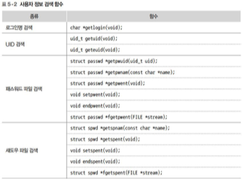
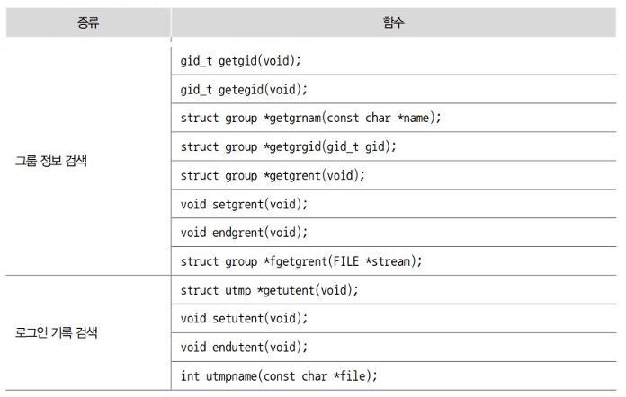
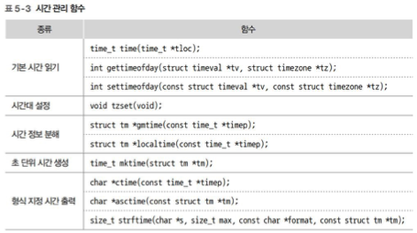

# 📝 시스템 정보 검색
## 1️⃣ 시스템 정보 검색
### 🎯 사용자 정보 검색 함수

#### [ 1. 시스템 정보 검색 ]
- 기본 환경과 관련된 구조체나 상수를 사용해 정보를 검색
- 시스템 환경 설정 정보

#### [ 2. 시스템 정보 검색 함수 ]
- uname() : 설치된 운영 체제 정보와 같은 시스템 기본 정보를 검색
- sysconf() : 시스템 자원 정보를 검색
- fpathconf(), pathconf() : 파일과 디렉터리 자원 정보를 검색

```
int uname(struct utsname *buf);
long sysconf(int name);
long fpathconf(int fd, int name);
long pathconf(const char *path, int name);
```


### 🎯 함수 목록




---

## 2️⃣ 운영체제 기본 정보 검색
### 🎯 내용 목록
```
int uname(struct utsname *buf);             // 시스템에 설치된 운영체제 이름, 버전, 호스트명, 하드웨어 정보 등 검색
int gethostname(char *name, size_t len);    // 현재 시스템에 설정된 호스트명을 검색 후 name에 저장
int sethosename(char *name, size_t len);    // 새로 설정할 호흐트 이름을 name에 저장

// 파일과 디렉터리 자원 검색
long fpathconf(int fd, int name);
long pathcof(const char *path, int name);   

char *getlogin(void);   // 로그인명 검색

uid_t getuid(void);     // 실제 사용자 ID
uid_t geteuid(void);    // 유효 사용자 ID

struct passwd *getwuid(uid_t uid);  // uid로 passwd 파일 읽기

gid_t getgid(void);     // 실제 그룹 id 반환
gid_t getegid(void);    // 유효 그룹 id 반환
```

### 🎯 uname() : 운영체제 정보 검색
#### [ 1. 설명 ]
```
#include <sys/utsname.h>

int uname(struct utsname *buf);
```
- 시스템에 설치된 운영체제 이름, 버전, 호스트명, 하드웨어 정보 등 검색

#### [ 2. utsname 구조체]
```
struct utsname {
    char sysname[];     // 운영체제의 이름
    char nodename[];    // 통신할 때 사용하는 시스템 이름 저장
    char release[];     // 운영체제 릴리즈 번호
    char version[];     // 운영체제 버전 번호 
    char machine[];     // 하드웨어 표준 이름(아키텍처)
}
```

#### [ 3. 코드 예시 ]
```
// ex_1.c

#include <sys/utsname.h>
#include <stdlib.h>
#include <stdio.h>

int main() {
    struct utsname uts;

    if (uname(&uts) == -1) {
        perror("uname");
        exit(1);
    }

    printf("OSname : %s\n", uts.sysname);
    printf("Nodename : %s\n", uts.nodename);
    printf("Release : %s\n", uts.release);
    printf("Version : %s\n", uts.version);
    printf("Machine : %s\n", uts.machine);
}
```

### 🎯 BSD 계열 유닉스 호스트명 검색
```
#include <unistd.h>

int gethostname(char *name, size_t len);    // 현재 시스템에 설정된 호스트명을 검색 후 name에 저장
int sethosename(char *name, size_t len);    // 새로 설정할 호흐트 이름을 name에 저장
```
- len : name의 길이

### 🎯 솔라리스의 sysinfo() 함수
```
#include <sys/systeminfo.h>

long sysinfo(int command, char *buf, long count);   
// command에 지정한 검색 또는 설정 명령에 따른 값을 buf에 저장
```

### 🎯 sysconf() : 시스템 자원 정보 검색
#### [ 1. 설명 ]
```
#include <unistd.h>

long sysconf(int name);
```
- name : 검색할 정보를 나타내는 상수
    1. _SC_ARG_MAX : exec() 계열 함수에 사용되는 인자의 최대 크기
    2. _SC_CHILD_MAX : 한 UID에 허용되는 최대 프로세스 수
    3. _SC_HOST_NAME_MAX : 호스트명의 최대 길이
    4. _SC_LOGIN_NAME_MAX : 로그인명의 최대 길이
    5. _SC_CLK_TCK : 초당 클릭 틱 수
    6. _SC_OPEN_MAX : 프로세스당 열 수 있는 최대 파일 수
    7. _SC_PAGESIZE : 시스템 메모리의 페이지 크기
    8. _SC_VERSION : 시스템이 지원하는 POSIX.1의 버전

#### [ 2. 코드 예시 ]
```
// ex_2.c

#include <unistd.h>
#include <stdio.h>

int main() {
    printf("Arg Max : %ld\n", sysconf(_SC_ARG_MAX));
    printf("Clock Tick : %ld\n", sysconf(_SC_CLK_TCK));
    printf("Max Open File : %ld\n", sysconf(_SC_OPEN_MAX));
    printf("Max Login Name Length : %ld\n", sysconf(_SC_LOGIN_NAME_MAX));
}
```

### 🎯 fpathconf/pathconf() : 파일과 디렉터리 자원 검색
#### [ 1. 설명 ]
```
#include <unistd.h>

long fpathconf(int fd, int name);
long pathcof(const char *path, int name);   // 파일과 디렉터리 자원 검색
```
- fd : 파일 기술자
- path : 파일이나 디렉터리 경로
- name : 검색할 정보를 지정하는 상수
    1. _PC_LINK_MAX : 파일에 가능한 최대 링크 수
    2. _PC_NAME_MAX : 파일명의 초대 길이 (byte 단위)
    3. _PC_PATH_MAX : 상대 경로명의 최대 길이 (byte 단위)

### 🎯 getlogin() : 로그인명 검색
#### [ 1. 설명 ]
```
#include <unistd.h>

char *getlogin(void);   // 로그인명 검색
```
- /var/run/utmp 파일을 검색해 현재 프로세스를 실행한 사용자의 로그인 명을 찾아 반환

### 🎯 getuid() : uid 정보 검색
#### [ 1. 설명 ]
```
#include <unistd.h>
#include <sys/types.h>

uid_t getuid(void);     // 실제 사용자 ID
uid_t geteuid(void);    // 유효 사용자 ID
```

#### [ 2. 예시 코드 ]
```
// ex_4.c

#include <sys/types.h>
#include <unistd.h>
#include <stdio.h>

int main() {
    uid_t uid, eid;
    char *name;

    uid = getuid();
    eid = geteuid();
    name = getlogin();

    printf("Login name : %s\n", name);
    printf("UID name : %d\n", (int)uid);
    printf("EID name : %d\n", (int)eid);
}
```

---

## 3️⃣ 사용자 정보 검색
### 🎯 /etc/passwd 파일의 구조
```
$ cat /etc/passwd
root:x:0:0:root:/root:/bin/vash

(로그인 ID):(PW):(UID):(EID):(계정 설명):(홈 디렉터리):(로그인 셸)
```

### 🎯 passwd 구조체
```
struct passwd {
    char *pw_name;      // 로그인명
    char *pw_passwd;    // 암호 (요즘 리눅스는 별도의 파일에 저장함으로 무의미)
    uit_t pw_uid;       // uid
    gid_t pw_gid;       // 기본 그룹 id
    char *pw_gecos;     // 사용자 실명이나 기타 정보
    char *pw_dir;       // 홈 디렉터리
    char *pw_shell;     // 로그인 셸
}
```

### 🎯 UID로 /etc/passwd 파일 읽기 : getwuid()
#### [ 1. 설명 ]
```
# include <sys/types.h>
# include <pwd.h>

struct passwd *getwuid(uid_t uid);  // uid로 passwd 파일 읽기
```
- /etc/passwd 파일에서 uid를 찾아 passwd 구조체에 저장 후 주소 반환

#### [ 2. 코드 예시 ]
```
// ex_5.c

#include <unistd.h>
#include <sys/types.h>
#include <pwd.h>
#include <stdio.h>

int main() {
    struct passwd *pw;

    pw = getpwuid(getuid());
    printf("UID : %d\n", (int)pw->pw_uid);
    printf("Login name : %s\n", pw->pw_name);
}
```

### 🎯 그룹 ID 검색 : getgid(), getegid()
#### [ 1. 설명 ]
```
#include <unistd.h>
#include <sys/types.h>

gid_t getgid(void);     // 실제 그룹 id 반환
gid_t getegid(void);    // 유효 그룹 id 반환
```

#### [ 2. 코드 설명 ]
```
#include <sys/types.h>
#include <unistd.h>
#include <stdio.h>

int main() {
    gid_t gid, egid;

    gid = getgid();
    egid = getegid();

    printf("GID : %d\n", (int)gid);
    printf("EGID : %d\n", (int)egid);
}
```

## 4️⃣ 시간 관리 함수
### 🎯 초 단위로 현재 시간 정보 얻기 : time()
#### [ 1. 설명 ]
```
#include <time.h>

time_t time(time_t *tloc);
```
- tloc : 검색한 시간 정보를 저장할 주소
#### [ 2. 코드 예시 ]
```
// ex_7

#include <sys/types.h>
#include <time.h>
#include <stdio.h>

int main() {
    time_t loc;

    time(&loc);
    printf("Time : %d\n", (int)loc);
}
```

### 🎯 마이크로초 단위로 시간 정보 얻기 : gettimeofday()
#### [ 1. 설명 ]
```
#include <sys/time.h>

int gettimeofday(struct timeval *tv, struct timezone *tz);
int settimeofday(const struct timeval *tv, const struct timezone *tz);
```
- tv : 시간 정보 구조체 주소
- tz : 시간대 정보 구조체 주소

**timval 구조체** : 
```
struct timeval {
    time_t tv_sec;          // 초
    suseconds_t tv_usec;    // 마이크로 초
}
```

#### [ 2. 코드 예시 ]
```
// ex_8.c

#include <sys/time.h>
#include <stdio.h>

int main() {
    struct timeval tv;

    gettimeofday(&tv, NULL);
    
    printf("Time(sec) : %d\n", (int)tv.tv_sec);
    printf("Time(msec) : %d\n", (int)tv.tv_usec);
}
```
<br>

### 🎯 tm 구조체
#### [ 1. tm 구조체 설명 ]
```
struct tm {
    int tm_sec;     // 초
    int tm_min;     // 분
    int tm_hour;    // 시간
    int tm_mday;    // 일
    int tm_mon;     //월
    int tm_year;    // 년
    int tm_wday;    // 요일
    int tm_yday;    // 일수
    int tm_isdst;   // 섬머타임제 여부
}
```

### 🎯 초 단위 시간 정보 분해 : gmtime(), localtime()
```
// ex_9.c

#include <time.h>

struct tm *gmtime(const time_t *timep);     // utc 기반 시간
struct tm *localtime(const time_t *timep);  // 지역 시간대 기반 시간
```
- timep : 초 단위 시간 정보를 저장할 주소

### 🎯 초 단위 시간 변환 출력 : ctime()
#### [ 1. 설명 ]
```
#include <time.h>

char *ctime(const time_t *timep);
```

#### [ 2. 코드 예시 ]
```
// ex_10.c
#include <time.h>
#include <stdio.h>

int main() {
    time_t timep;

    time(&timep);

    printf("Time(sec) : %d\n", (int)timep);
    printf("Time(date) : %s", ctime(&timep));
}
/*
출력 결과 : 
Time(sec) : 1759210661
Time(date) : Tue Sep 30 14:37:41 2025
*/
```

### 🎯 tm 구조체 시간 변환 출력 : asctime()
#### [ 1. 설명 ]
```
#include <time.h>

char *asctime(const struct tm *tm);
```
- tm : 시간 정보를 저장한 tm 구조체 주소

#### [ 2. 코드 예시 ]
```
// ex_11.c

#include <time.h>
#include <stdio.h>

int main() {
    struct tm *tm;
    time_t timep;

    time(&timep);
    tm = localtime(&timep);

    printf("Time(sec) : %d\n", (int)timep);
    printf("Time(date) : %s\n", asctime(tm));
}
/*
실행 결과 : 
Time(sec) : 1759210931
Time(date) : Tue Sep 30 14:42:11 2025
*/
```

## 5️⃣ 디렉토리 트리의 산책
### 🎯 ftw()
#### [ 1. 설명 ]
주어진 디렉토리부터 출발하여 그 디렉토리 아래에 있는 모든 파일과 일부 디렉토리에 대한 작업 수행하기
```
#include <ftw.h>

int ftw(const char *path, int(*func)(), int depth)
```
- 인자 : int(*func)(const char *path, const struct stat *sptr, int type)
    - type :
        1. FTW_F : 객체가 하나의 파일명
        2. FTW_D : 객체가 하나의 디렉토리
        3. FTW_DNR : 객체가 읽을 수 없는 하나의 디렉토리
        4. FTW_SL : 객체가 하나의 심볼형 링크
        5. FTW_NS : 객체가 심볼형 링크가 아님 (stat 루틴이 성공적으로 수행 불가)

#### [ 2. 코드 예시 ]
```
// ex_12.c

#include <sys/stat.h>
#include <ftw.h>
#include <stdlib.h>
#include <stdio.h>

int list(const char *name, const struct stat *status, int type) {
    if(type == FTW_NS) { return 0; }

    if(type == FTW_F) { printf("% - 20s\t0%3o\n", name, status->st_mode&0777); }
    else { printf("% - 20s*\t0%3o\n", name, status->st_mode&0777); }
    
    return 0;
}

int main(int argc, char *argv[]) {
    int list(const char *, const struct stat *, int);

    if(argc == 1) { ftw(".", list, 1); }
    else { ftw(argv[1], list, 1); }

    exit(0);
}
```