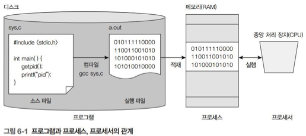
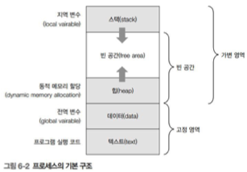
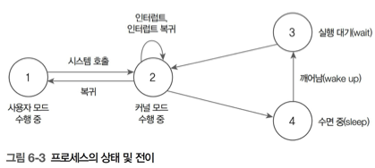

# 프로세스
**기본 개념은 시험에 나오지 않는다!**

## 1️⃣ 프로세스

### 🎯 프로세스
- 프로세스 : 현재 실행중인 프로그램
- 실행, 수면, 실행 대기 등 규칙에 따라 여러 상태로 전환
- `$ps`, `$top`으로 실행중인 프로세스 확인 가능

### 🎯 세션
```
int sysinfo(struct sysinfo *info);      // 메모리와 스왑 상태 검색
pid_t getpid(void);                     // pid 검색
pid_t getppid(void);                    // 부모 pid 검색
pid_t getpgrp(void);                    // 프로세스 그룹 ID 검색
pid_t getpgid(pid_t pid);               // 프로세스 그룹 ID 검색
int setpgid(pid_t pid, pid_t pgid);     // 프로세스 그룹 ID 변경
pid_t getsid(pid_t pid);                // 세션 리더 ID 검색
pid_t setsid(void);                     // 세션 생성
```

### 🎯 프로세스 실행 시간
1. 시스템 실행 시간 : 프로세스에서 커널의 코드를 수행한 시간
2. 사용자 실행 시간 : 사용자 모드에서 프로세스를 실행한 시간

### 🎯 환경 변수
```
extern char **environ;              // 환경 설정 전역 변수 사용
char *getenv(const char *name);     // 환경 변수 검색

// 환경 변수 설정 및 삭제
int putenv(char *string);
int setenv(const char *name, const char *Value, int overwrite);
int unsetenv(const char *name);
```


## 2️⃣ 프로세스의 개념
### 🎯 프로세스 정의

- 프로세스 : 실행중인 프로그램
- 프로세서 : 중앙 처리 장치
- 프로그램 : 사용자가 컴퓨터 작업을 시키기 위한 명령어의 집합

### 🎯 프로세스 구조

- 텍스트 영역 : 실행코드를 저장한 구역
- 데이터 영역 : 프로그램에서 정의한 전역 변수를 저장
- 힙 영역 : 프로그램 실행 중에 동적으로 메모리를 요청하는 경우에 할당
- 스택 영역 : 프로그램에서 정의한 지역 변수를 저장하는 메모리 영역
- 빈 공간 : 가변적 메모리 할당을 위해 유지하는 영역

### 🎯 프로세스 상태 변화

1. 프로세스는 사용자 모드에서 먼저 실행됨
2. 사용자 모드에서 시스템 호출 시 커널 모드로 전환되어 실행
3. 수면 중이던 프로세스가 깨어나 실행 대기 상태가 되면 바로 실행할 수 있도록 준비
4. 커널 모드에서 실행 중 입출력 완료를 기다릴 때와 같이 더 이상 실행을 계속할 수 없을 때 수면 상태로 전환

### 🎯 프로세스 목록 보기 : $PS
```
// 시험에는 안나온다
grep -rI stdio
grep -rR stdio
grep -r stio

ps -ef | more
```
### 🎯 시스템 메모리 정보 보기 : $TOP

### 🎯 메모리와 스왑 상태 검색 : sysinfo()
#### [ 1. 설명 ]
```
#include <sys/sysinfo.h>

int sysinfo(struct sysinfo *info);
```
- sysinfo 구조체에 검색 결과를 저장해 반환

#### [ 2. sysinfo ]
```
struct sysinfo {
    long uptime;                // 시스템 부팅 후 경과된 시간
    unsigned long loads[3];     // 시스템 부하 평균
    unsigned long totalram;     // 사용 가능한 총 메모리 수
    unsigned long freeram;      // 사용 가능한 메모리의 크기
    unsigned long sharedram;    // 공유 메모리의 크기
    unsigned long bufferram;    // 버퍼가 사용하는 메모리의 크기
    unsigned long totalswap;    // 스왑 영역의 총 크기
    unsigned long freeswap;     // 사용 가능한 스왑 영역의 크기
    unsigned short procs;       // 실행중인 프로세스 수
    unsigned long totalhigh;    // 할당된 메모리의 총 크기
    unsigned long freehigh;     // 사용 가능한 사용자 메모리의 크기
    unsigned int mem_unit;      // 메모리 크기를 바이트 단위로 저장
    char _f[];                  // 64바이트 크기를 맞추기 위한 패딩
}
```

#### [ 3. 코드 예시 ]
```
// ex_1.c

#include <sys/sysinfo.h>
#include <stdio.h>

int main() {
    struct sysinfo info;

    sysinfo(&info);

    printf("Total Ram: %ld\n", info.totalram);
    printf("Free Ram: %ld\n", info.freeram);
    printf("Num of Processes: %d\n", info.procs);
}
```

## 3️⃣ 프로세스 식별
### 🎯 PID
- PID : Process ID
- 0번 부터 시작
    - 0번 프로세스 : 스케줄러 (프로세스에 cpu 시간을 할당하는 역할 수행)
    - 1번 프로세스 : init으로 프로세스가 새로 생성될 때마다 기존 pid와 중복됮 않은 번호 할당

### 🎯 현 프로세스의 PID 얻기 : getpid()
#### [ 1. 설명 ]
```
#include <sys/types.h>
#include <unistd.h>

pid_t getpid(void);
```

#### [ 2. 코드 예시 ]
```
// ex_2.c

#include <unistd.h>
#include <stdio.h>

int main() {
    printf("PID : %d\n", (int)getpid());
    printf("PPID : %d\n", (int)getppid());
}
```

### 🎯 PPID 검색 : getppid()
#### [ 1. 설명 ]
```
#include <sys/types.h>
#include <unistd.h>

pid_t getppid(void);
```

#### [ 2. 코드 예시 ]
```
// ex_2.c

#include <unistd.h>
#include <stdio.h>

int main() {
    printf("PID : %d\n", (int)getpid());
    printf("PPID : %d\n", (int)getppid());
}
```

### 🎯 PGID 검색 : getpgrp(), getpgid()
#### [ 1. 설명 ]
```
#include <sys/types.h>
#include <unistd.h>

pid_t getpgrp(void);
pid_t getpgid(pid_t pid);
```

#### [ 2. 코드 예시 ]
```
// ex_3.c

#include <stdio.h>
#include <unistd.h>

int main() {
    printf("PID : %d\n", (int)getpid());
    printf("PGRP : %d\n", (int)getpgrp());
    printf("PGID(0) : %d\n", (int)getpgid(0));
    printf("PGID(18020) : %d\n", (int)getpgid(18020));
}
```

### 🎯 PGID 변경 : setpgid()
#### [ 1. 설명 ]
```
#include <sys/types.h>
#include <unistd.h>

int setpgid(pid_t pid, pid_t pgid);
```
- pid : 프로세스 그룹에 속한 프로세스 id
- pgid : 새로 지정할 pgid

## 4️⃣ 프로세스 실행 시간 측정
### 🎯 프로세스 실행 시간
- 프로세스 실행 시간 = 시스템 실행 기간 + 사용자 실행 기간

### 🎯 tms 구조체
```
struct tms {
    clock_t tms_utime;  // 프로세스가 사용한 사용자 모드 실행시간
    clock_t tms_stime;  // 프로세스가 사용한 커널모드 실행 시간
    clock_t tms_cutime; // 프로세스의 모든 자식 프로세스가 사용한 사용자 모드/실행 시간, tms_utime 시간의 합
    clock_t tms_cstime; // 프로세스의 모든 자식 프로세스가 사용한 사용자 모드/실행 시간, tms_stime 시간의 합
}
```

### 실행 시간 측정 : times()
#### [ 1. 설명 ]
```
#include <sys/times.h>

clock_t times(struct tms *buf);
```

#### [ 2. 코드 예시 ]
```
ex_4.c

#include <sys/types.h>
#include <sys/times.h>
#include <time.h>
#include <unistd.h>
#include <stdlib.h>
#include <stdio.h>

int main() {
    int i;
    time_t t;
    struct tms buf;
    clock_t ct, t1, t2;

    ct = sysconf(_SC_CLK_TCK);
    printf("Clock tick : %ld\n", ct);

    if ((t1 = times(&buf)) == -1) {
        perror("times 1");
        exit(1);
    }

    for (i = 0; i < 99999999; i++)
        time(&t);
    sleep(1);

    if ((t2 = times(&buf)) == -1) {
        perror("times 2");
        exit(1);
    }

    printf("t1: %ld\n", t1);
    printf("t2: %ld\n", t2);
    printf("utime : %ld\n", buf.tms_utime);
    printf("stime : %ld\n", buf.tms_stime);
    printf("Real time : %.1f sec\n", (double)(t2 - t1) / ct);
    printf("User time : %.1f sec\n", (double)buf.tms_utime / ct);
    printf("System time : %.1f sec\n", (double)buf.tms_stime / ct);
}


```