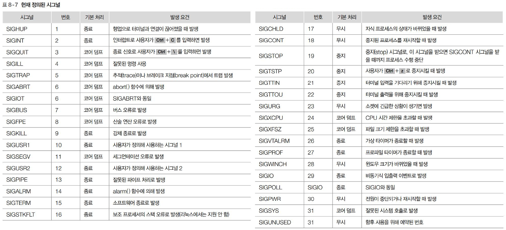
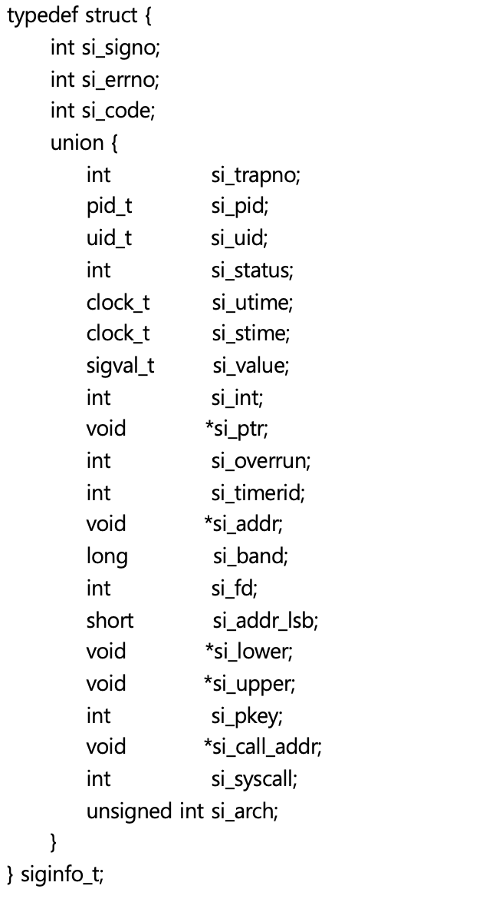
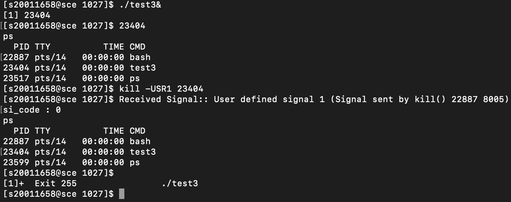

# 시그널

## 1️⃣ 시그널
- 인터럽트로 프로세스에 뭔가 발생함을 알리는 간단한 메시지를 비동기적으로 보내는 것
- 보통 시그널로 전달되는 메시지는 무엇이 발생했는지를 표시하는 미리 정의된 상수를 사용

**[ 시그널이란? ]**
- 시그널 : 소프트웨어 인터럽트
- 발생 요인

    1. 0으로 나누기와 같은 예외 케이스
    2. Kill()과 같이 시그널을 보낼 수 있는 함수로 타 프로세스에 시그널을 보내는 경우
    3. 사용자의 인터럽트 (^C 등)

**[ 시그널 처리 방법 ]**
1. 기본 동작 수행
    - 프로세스 종료
    - 프로세스 수행 일시 중지 / 재시작
2. 시그널 무시
3. 지정된 함수 호출
    - 시그널 핸들러 : 시그널 처리를 위해 지정하는 함수
    - 미리 함수 지정 
    - 시그널을 받을 시 : 기존 처리 작업을 중지 -> 해당 함수를 호출하여 처리

**[ 시그널 종류 ]**


**[ 코드 ]**
```c
int kill(pid_t pid, int sig);
int raise(int sig);
void abort(void);
```


## 2️⃣ 시그널 관련 함수


### 🎯 시그널 보내기 : kill
```c
#incldue <sys/types.h>
#include <signal.h>

int kill(pid_t pid, int sig);
```

**[ 인자 ]**
- pid_t pid : 시그널을 받을 프로세스의 PID
    - pid > 0 : pid로 지정한 프로세스에 시그널을 전송
    - pid == 0 : PGID가 시그널을 보내는 프로세스의 PGID와 같은 모든 프로세스에 시그널을 전송
    - pid == -1 : 프로세스의 UID가 root가 아닐 시, 프로세스 UID와 같은 모든 프로세스에게 시그널 전송
    - pid < -1 : 프로세스 그룹에 속하고 시그널을 보낼 권한이 있는 모든 프로세스에 시그널 전송
- int sig : pid로 지정한 프로세스에 보내는 시그널

**[ 코드 예시 ]**
```c
// ex_1.c

#include <sys/types.h>
#include <unistd.h>
#include <signal.h>
#include <stdio.h>

int main(void) {
    printf("Before SIGCONT Signal to parent.\n");
    kill(getppid(), SIGCONT);

    printf("Before SIGQUIT Signal to me.\n");
    kill(getpid(), SIGQUIT);

    printf("After SIGQUIT Signal.\n");
    return 0;
}
```


### 🎯 시그널 보내기 : raise()
**[ raise() 예시 ]**
```c
#include <signal.h>
int raise(int sig)
```
- sig : 보내려는 시그널 번호

**[ 특징 ]**
- 호출한 프로세스에 인자로 지정한 시그널을 전송
- 시그널 핸들러 호출 -> 핸들러의 수행이 끝날 때까지 raise()는 리턴하지 않음


### 🎯 시그널 보내기 : abort()
**[ abort() ]**
```c
#include <stdlib.h>
void abort(void);
```
- 호출한 프로세스에 SIGBART 시그널 전송
    - SIGBART 시그널 : 프로세스를 비정상적으로 종료시키고 코어 덤프 파일을 생성 (리턴 안함)


## 3️⃣ 시그널 핸들러
- 프로세스 종료 전에 처리할 작업이 남아 있을 시 시그널을 처리할 함수를 지정하는 것.

```cpp
sighandler_t signal(int signum, sighandler_t handler);
sighandler_t sigset(int sig, sighandler_t disp);
```

### 🎯 시그널 핸들러 지정 : signal()

```c
#include <signal.h>
typedef void (*sighandler_t)(int);
sighandler_t signal(int signum, sighandler_t handler);
```

**[ 인자 ]**
- signum : 시그널 핸들러로 처리하려는 시그널
- handler : 시그널 핸들러의 함수명

**[ 함수 특징 ]**
- 시그널을 받을 때 해당 시그널을 처리할 함수나 상수를 지정 가능
- signum : SIGKILL과 SIGSTOP 시그널을 제외한 모든 시그널 지정 가능
- handler : signum으로 지정한 시그널을 받았을 때 처리할 방법을 지정

**[ 핸들러 설정 ]**
- 시그널 핸들러 주소
- SIG_IGN : 시그널을 무시하도록 지정
- SIG_DFL " 시그널의 기본 처리 방법을 수행하도록 지정

**[ 핸들러 설정 ]**
```c
// ex_2.c

#include <unistd.h>
#include <signal.h>
#include <stdio.h>
#include <stdlib.h>

void handler(int signo) {
     printf("Signal Handler Signal Number : %d\n", signo);
     psignal(signo, "Received Signal");
}

int main(void) {
    void (*hand)(int);

    hand = signal(SIGINT, handler);
    if (hand == SIG_ERR) {
        perror("signal");
        exit(1);
    }

    printf("Wait 1st Ctrl+C... : SIGINT\n");
    pause();
    printf("After 1st Signal Handler\n");
    printf("Wait 2nd Ctrl+C... : SIGINT\n");
    pause();
    printf("After 2nd Signal Handler\n");
    return 0;
}
```

**[ 시그널 핸들러 : 솔라리스의 경우 ]**
```c
#include <unistd.h>
#include <signal.h>
#include <stdio.h>
#include <stdlib.h>

void sig_handler(int signo) {
    void (*hand)(int);

    hand = signal(SIGINT, sig_handler);
    if(hand == SIG_ERR) {
        perror("signal");
        exit(1);
    }
    printf("Signal Handler Signal Number : %d\n", signo);
    psignal(signo, "Received Signal");
}
```


### 🎯 시그널 핸들러 지정 : sigset()

```c
#include <signal.h>
sighandler_t sigset(int sig, sighandler_t disp);
```
- sig : 시그널 핸들러로 처리하려는 시그널
    - SIGKILL, SIGSTOP을 제외한 어떤 시그널도 지정 가능
- disp : 시그널 핸들러의 함수명
    - 시그널 핸들러의 주소, SIG_IGN, SIG_DFL중 하나를 지정

**[ 함수 특징 ]**
- 실패시 SIG_ERR을 리턴

**[ 예시 ]**
```c
#include <unistd.h>
#include <signal.h>
#include <stdlib.h>
#include <stdio.h>

void sig_handler(int signo) {
    printf("Signal Handler Signal Number : %d\n", signo);
    psignal(signo, "Received Signal");
}

int main(void) {

    //sigset(SIGINT, SIG_DFL);
    sigset(SIGINT, SIG_IGN);
    //sigset(SIGINT, sig_handler);
#if 0
    if (hand == SIG_ERR) {
        perror("signal");
        exit(1);
    }
#endif
    printf("Wait 1st Ctrl+C... : SIGINT\n");
    pause();
    printf("After 1st Signal Handler\n");
    printf("Wait 2nd Ctrl+C... : SIGINT\n");
    pause();
    printf("After 2nd Signal Handler\n");
}
```


## 4️⃣ 시그널 집합
- POSIX에서 복수의 시그널을 처리하기 위해 도입한 개념
- 시그널 집합 사용 시 여러 시그널을 지정해 처리 가능

```cpp
int sigemptyset(sigset_t *set);
int sigfillset(sigset_t *set);
int sigaddset(sigset_t *set, int signum);
int sigdelset(sigset_t *set, int signum);
int sigismember(sigset_t *set, int signum);
```


### 🎯 시그널 집합 개념
- 시그널 집합 : 시그널을 비트 마스크로 표현한 것
- 각 비트가 특정 시그널과 1:1로 연결됨
- 시스템에서는 시그널 집합 처리를 위해 sigset_t 구조체를 제공

**[ 리눅스 ]**
    ```
    #typedef struct {
        unsigned long _val[_NSIG_WORDS];
    } sigset_t;
    ```

**[ 솔라리스 ]**
    ```
    #typedef struct {
        unsigned int _sigbits[4];
    } sigset_t;
    ```


### 🎯 sigemptyset()
```c
#include <signal.h>
int sigemptyset(sigset_t *set);
```
- set : 비우려는 시그널 집합의 주소

**[ 특징 ]**
- 모든 시그널을 비우고 빈 집합으로 만듬 
- 시그널 집합의 모든 비틀를 0으로 설정


### 🎯 sigfillset()
```c
#include <signal.h>
int sigfillset(sigset_t * set);
```
- set : 비우려는 시그널 집합의 주소

**[ 특징 ]**
- 모든 시그널을 다 채운 집합으로 만듬 
- 시그널 집합의 모든 비틀를 1로 설정


### 🎯 시그널 집합에 시그널 설정 추가 : sigaddset()
```c
#include <signal.h>
int sigaddset(sigset_t *set, int signum);
```
- set : 시그널을 추가하려는 시그널 집합의 주소
- signum : 시그널 집합에 추가로 설정하려는 시그널


### 🎯 시그널 집합에 시그널 설정 제거 : sigdelset()
```c
#include <signal.h>
int sigdelset(sigset_t *set, int signum);
```
- set : 시그널을 추가하려는 시그널 집합의 주소
- signum : 시그널 집합에 추가로 설정하려는 시그널


### 🎯 시그널 집합에 시그널 설정 제거 : sigismember()
```c
#include <signal.h>
int sigismember(sigset_t *set, int signum);
```
- set : 시그널을 추가하려는 시그널 집합의 주소
- signum : 시그널 집합에 추가로 설정하려는 시그널


### 🎯 시그널 집합 처리 함수 사용 예제
```c
// ex_4.c

#include <unistd.h>
#include <signal.h>
#include <stdio.h>
#include <stdlib.h>

int main(void) {

    sigset_t st;
 
    sigemptyset(&st);
  
    sigaddset(&st, SIGINT);
    sigaddset(&st, SIGQUIT);
  
    if (sigismember(&st, SIGINT))
        printf("SIGINT is setting.\n");
 
    printf("** Bit Pattern: %lx\n",st.__val[0]);
  
    return 0;
}
```


## 5️⃣ 시그널 제어 함수
- 시그널을 받아 이를 처리할 시그널 핸들러를 지정할 뿐 만 아니라 플래그를 설정해 시그널 처리 과정을 제어

```cpp
int sigcation(int signum, const struct sigaction *act, struct sigaction *oldact);
void psiginfo(const siginfo_t *pinfo, const char *s);
```


### 🎯 sigaction 구조체
```cpp
struct sigaction {
    int sa_flags;
    void (*sa_handler)(int);    
    void (*sa_sigaction)(int, siginfo_t *, void *);
    sigset_t sa_mask;   // 시그널 핸들러가 수행하는 동안 블로킹될 시그널
    void (*sa_restorer)(void);
}
```

```c
struct sigaction {
    int sa_flags;
    union {
        void (*sa_handler)();
        void (*sa_sigaction)(int, siginfo_t *, void *);
    } _funcptr;
    sigset_t sa_mask;
}
```
- sa_flags에 SA_SIGINFO가 설정되어 있지 않으면 sa_handler에는 시그널을 처리할 동작을 지정
- sa_flags에 SA_SIGINFO가 설정되어 있으면 sa_sigaction 멤버를 사용


**[ sa_flags ]**
1. sa_mask에는 시그널 핸들러가 동작 중일 때 블로킹할 시그널을 시그널 집합으로 지정함
2. 시그널 핸들러가 시작될 시 이미 블로킹된 시그널 집합에 sa_mask로 지정한 시그널 집합을 추가
- SA_NOCLDSTOP : signum이 SIGCHLD라면 자식 프로세스를 중지하거나 재시작시 부모 프로세서에 전달 X
- SA_NOCLDWAIT : 시그널이 SIGCHLD라면 시스템은 자식 프로세스 종료 시 좀비 프로세스로 만들지 않음
- SA_NODEFER : 시그널 핸들러 처리 동안 해당 시그널은 시스템 커널에 의해 블로킹 되지 않음
- SA_ONSTACK : sigaltstack() 호출로 생성한 대체 시그널 스택에 있는 시그널 핸들러 호출
- SA_RESETHAND : 시그널 기본 처리 방법을 SIG_DFL로 재설정
- SA_RESTART : 시그널 처리와 관련된 시스템 호출을 재시작
- SA_SIGINFO : 


### 🎯 sigaction() 함수의 활용

**[ 설명 ]**
```c
#include <signal.h>
int sigaction(int signum, const struct sigaction *act, struct sigaction *oldact)
```
- signum : 처리할 시그널 (SIGKILL, SIGSTOP 외 모든 시그널 사용 가능)
- act : 시그널을 처리할 방법을 지정한 구조체 주소
- oldact : 기존에 시그널을 처리하던 방법을 저장할 구조체 주소

**[ sigaction() 함수의 특징 ]**
- 시그널을 받아 이를 처리할 시그널 핸들러를 지정
- 시그널 핸들러 수행되는 동안 다른 시그널 블로킹 가능

**[ sigaction() 함수 예시 ]**
```c
// ex_5.c

#include <unistd.h>
#include <signal.h>
#include <stdio.h>
#include <stdlib.h>

// 시그널 핸들러 지정 (5초간 실행 대기)
void handler(int signo) {
    psignal(signo, "Received Signal:");
    sleep(5);
    printf("In Signal Handler, After Sleep\n");
}

int main(void) {

   struct sigaction act;
 
   sigemptyset(&act.sa_mask);
   sigaddset(&act.sa_mask, SIGQUIT);    // 시그널 핸들러 동작 중 SIGQUIT 시그널을 블로킹하기 위해 sa_mask에 SIGQUIT 시그널을 추가

   act.sa_flags = 0;            // sa_flags에 지정 해제
   act.sa_handler = handler;    

    // SIGINT 시그널을 받을 경우의 동작 설정
    if (sigaction(SIGINT, &act, (struct sigaction *)NULL) < 0) {
        perror("sigaction");
        exit(1);
    }
  
   fprintf(stderr, "Input SIGINT: ");
   pause();
   fprintf(stderr, "After Signal Handler\n");
  
   return 0;
}
```

**[ 🎯 SA_RESETHAND 플래그 예시 ]**
```c
/* 기존 ex_5 코드 */
int main(void) {
    /* 이전 코드 동일 */
    act.sa_flags = SA_RESTHAND; // SA_RESETHAND 플래그 설정으로 인해 SIGINT 시그널의 처리 방법이 기본 처리 방법으로 재설정
    act.sa_handler = sig_handler;
    /* 차후 코드 동일 */
}
```


**[ 시그널 발생 원인 검색 ]**
```c
void handler(int sig, siginfo_t *info, void *ucontext) { /*함수 원형*/ }
```
- sig : 시그널 핸들러를 호출할 시그널
- info : 시그널이 발생한 원인을 담은 siginfo_t rnwhcp vhdlsxj
- ucontext : 시그널이 전달될 때 시그널을 받는 프로세스의 내부 상태를 나타내는 포인터

**[ siginfo_t 구조체 ]**


**[ 사용자 프로세스에 의한 시그널 발생 원인 코드 ]**
- SI_USER   : 0     : kill(), raise()로 시그널을 보냄
- SI_KERNEL : 128   : 커널이 시그널을 보냄 
- SI_QUEUE  : -1    : sigqueue()로 시그널을 보냄  
- SI_TIMER  : -2    : timer_settime()가 생성한 타이머가 만료되어 시그널을 보냄
- SI_MESGQ  : -3    : POSIX 메시지 큐의 상태가 변해서 시그널을 보냄
- SI_ASYNCIO: -4    : 비동기 입출력이 완료되어 시그널을 보냄
- SI_SIGIO  : -5    : SIGIO 시그널이 큐에 들어와서 시그널을 보냄


### 🎯 시그널 발생 원인 출력 함수 : psiginfo()

**[ 설명 ]**
```c
#include <siginfo.h>
void psiginfo(const siginfo_t *pinfo, const char *s);
```
- pinfo : 시그널 발생 원인에 관한 정보를 저장하고 있는 구조체 포인터
- s : 출력할 문자열

**[ psiginfo() 예시 ]**
```c
// ex_6.c
#include <sys/ucontext.h>
#include <unistd.h>
#include <signal.h>
#include <stdlib.h>
#include <stdio.h>

void sig_handler(int signo, siginfo_t *sf, ucontext_t *uc) {
    psiginfo(sf, "Received Signal:");
    printf("si_code : %d\n", sf->si_code);
    sleep(5);
}

int main() {
    struct sigaction act;

    act.sa_flags = SA_SIGINFO|SA_RESETHAND;
    act.sa_sigaction = (void (*)(int, siginfo_t *, void *))sig_handler;
    sigemptyset(&act.sa_mask);
    if (sigaction(SIGUSR1, &act, (struct sigaction *)NULL) < 0) {
        perror("sigaction");
        perror("sigaction");
        exit(1);
    }
	printf("%d\n", getpid());
    pause();
}
```

**[코드 실행 예시]**



## 6️⃣ 알람 시그널
- 일정 시간이 지난 후 자동으로 시그널을 발생시킴

```cpp
unsigned int alarm(unsigned int seconds);
int getitimer(int which, struct itimerval *curr_value);
int setitimer(int which, const struct itimerval *value, struct itimerval *ovalue);
```


### 🎯 알람 시그널 생성 : alarm
```c
#include <unistd.h>
unsigned int alarm(unsigned int seconds);
```
- seconds : 알람을 발생시킬 때까지 남은 시간(초)

**[ alram() 함수 특징 ]**
- 인자로 지정한 시간이 지나면 SIGALRM 시그널이 생성되어 프로세스에 전달
- 프로세스별 알람 시계는 하나만 있음으로 알람은 하나만 설정 가능

**[ 코드 예시 ]**
```c
//ex_7

#include <unistd.h>
#include <signal.h>
#include <stdio.h>

void sig_handler(int signo) {
    psignal(signo, "Received Signal");
}

int main() {
    signal(SIGALRM, sig_handler);

    alarm(2);
    printf("Wait...\n");
    sleep(3);
}
```


### 🎯 인터벌 타이머 

**[ 타이머 종류 ]**
1. ITMER_REAL 
    - 실제 시간을 이용
    - 만료시 SIGALRM 시그널 생성
2. ITIMER_VIRTUAL
    - 사용자 모드 CPU 시간 사용
    - 프로세스 동작 중에만 작동, 만료시 SIGVTALRM 시그널 생성 
3. ITIMER_PROF
    - 프로세스가 사용하는 시스템 모드와 사용자 모드 CPU 시간을 합해 사용
    - 만료시 SIGPROF 시그널 생성
    - ITIMER_VIRTUAL와 함께 사용 시 사용자 모드 CPU 시간과 시스템 모드 CPU 시간을 모두 알 수 있음


### 🎯 타이머 정보 검색 : getitimer()

**[ 코드 ]**
```c
#include <sys/time.h>
int getitimer(int which, struct itimerval *curr_value);
```
- which : 검색할 타이머 종류
- curr_Value : 타이머 정보를 저장할 구조체 포인터

**[ 설명 ]**
- 타이머 정보를 검색하는 함수
- 타이머 정보 : 타이머의 현재 시간과 타이머 간격 정보를 저장할 itimerval 구조체 포인터

**[ itimerval 구조체 ]**
```c
struct itimerval {
    struct timeval {
        time_t tv_sec;
        suseconds_t tv_usec;
    }it_interval;
    struct timeval it_value;    // 타이머가 만료 될 때까지 남은 시간
}
```


### 🎯 타이머 설정 : setitimer()
**[ 코드 ]**
```c
#include <sys/time.h>
int setitmer(int which, const struct itimerval *value, struct itimerval *ovalue);
```
- which : 설정할 타이머의 종류
- value : 설정할 타이머의 정보를 저장한 구조체 포인터
- ovalue : 이전 타이머의 정보를 저장할 구조체 포인터

**[ 설명 ]**
- 타이머 설정
- ^z로 백그라운드 실행을 시킨 후 종료(kill)로 종료 가능

**[ 예시 ]**
```c
// ex_8.c

#include <sys/time.h>
#include <unistd.h>
#include <signal.h>
#include <stdlib.h>
#include <stdio.h>

void sig_handler() {
    printf("Timer Invoked..\n");
}

int main() {
    struct itimerval it;

    signal(SIGALRM, sig_handler);
    it.it_value.tv_sec = 3;
    it.it_value.tv_usec = 0;
    it.it_interval.tv_sec = 2;
    it.it_interval.tv_usec = 0;

    if (setitimer(ITIMER_REAL, &it, (struct itimerval *)NULL) == -1) {
        perror("setitimer");
        exit(1);
    }

    while (1) {
        if (getitimer(ITIMER_REAL, &it) == -1) {
            perror("getitimer");
            exit(1);
        }
        printf("%d sec, %d msec.\n", (int)it.it_value.tv_sec, (int)it.it_value.tv_usec);
        sleep(1);
    }
}
```


## 7️⃣ 기타 시그널 처리 함수


### 🎯 시그널 정보 출력 : psignal()
**[ 코드 ]**
```c
#include <signal.h>
void psignal(int sig, const char*s)
```
- sig : 정보를 출력할 시그널
- s : 출력할 문자열


### 🎯 시그전 정보 출력 : strsignal()
**[ 코드 ]**
```c
#include <signal.h>
char* strsignal(int sig)
```
- sig : 정보를 출력할 시그널


### 🎯 시그널 블로킹과 해제 : sighold(), sigrelse()
**[ 코드 ]**
```c
#include <signal.h>

int sighold(int sig);
int sigrelse(int sig);
```
- sig : 블록하거날 해제할 시그널

**[ 대체 권장 코드 ]**
```c
int sigaction(int sig);
```

**[ 대체 권장 코드 ]**
```c
//ex_9.c

#include <unistd.h>
#include <signal.h>
#include <stdlib.h>
#include <stdio.h>
#include <string.h>

void sig_handler(int signo) {
    char *s;

    s = strsignal(signo);
    printf("Received Signal : %s\n", s);
}

int main() {
    if (signal(SIGINT, sig_handler) == SIG_ERR) {
        perror("signal");
        exit(1);
    }

    sighold(SIGINT);
    pause();
}
```


### 🎯 시그널 집합 블로킹과 해제 : sigprocmask()
**[ 코드 ]**
```c
#include <signal.h>

int sigprocmask(int how, const sigset_t *set, sigset_t *oldset);
```
- how : 시그널을 블로킹할 지 해제할 지 여부
    - SIG_BLOCK
    - SIG_UNBLOCK
    - SIG_SETMASK : set에 지정한 시그널 집합으로 현 시그널 마스크 대체
- set : 블로킹하거나 해제할 시그널 집합의 주소
- oldset : NULL 또는 이전 설정값을 저장할 시그널 집합의 주소

**[ 예시 ]**
```c
#include <unistd.h>
#include <signal.h>
#include <stdio.h>

int main() {
    sigset_t new;

    sigemptyset(&new);
    sigaddset(&new, SIGINT);
    sigaddset(&new, SIGQUIT);
    sigprocmask(SIG_BLOCK, &new, (sigset_t *)NULL);

    printf("Blocking Signals : SIGINT, SIGQUIT\n");
    printf("Send SIGQUIT\n");
    kill(getpid(), SIGQUIT);

    printf("UnBlocking Signals\n");
    sigprocmask(SIG_UNBLOCK, &new, (sigset_t *)NULL);
}
```


### 🎯 시그널 기다리기 : pause(), sigsuspend()

**[ 코드 ]**
```c
#include <unistd.h>
#include <signal.h>

int pause(void);
int sigsuspend(const sigset_t *mask);   // 인자값(시그널 집합)에 설정된 시그널들로 프로세스의 시그널 마스크 교체
```
- mask : 기다리려는 시그널을 지정한 시그널 집합의 주소

**[ 코드 ]**
```c
// ex_10.c

#include <unistd.h>
#include <signal.h>
#include <stdio.h>

void sig_handler(int signo) {
    psignal(signo, "Received Signal:");
}

int main() {
    sigset_t set;

    signal(SIGALRM, sig_handler);

    sigfillset(&set);
    sigdelset(&set, SIGALRM);

    alarm(5);

    printf("Wait...\n");

    sigsuspend(&set);
}
```

