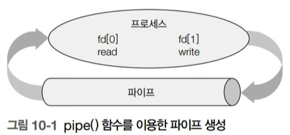

# 파이프

## 1️⃣ 파이프

### 🎯 파이프란?
- 두 프로세스 사이에서 한 방향으로 통신할 수 있도록 지원하는 것
- Shell에서 `|` 가 파이프를 의미
```shell
$ cat test.c | more
```
- cat test.c의 표준 출력을 다음 명령인 more의 표준 입력으로 사용

(18)
- write()시 파이프에 충분한 공간이 있으면 파이프 저장
1. 쓰기 전용 파일 기술자를 닫은 경우 :
2. 읽기 저뇽 파일 기술자를 닫은 경우 : 
    - 자료 읽기를 위해 해당 파이프를 개방햔 타 프로세스 존재 : Ok
    - SIGPIPE 시그널 (오류)


### 🎯 이름 없는 파이프 : pipe
```c
FILE *popen(const char *command, const char *type); // 고수준 시스템콜
int pclose(FILE *stream);   // 저수준 시스템 콜

int pipe(int pipefd[2]);
```
- 부모-자식 프로세스간 통신
- 단 방향 통신 : '부모->자식' 또는 '자식->부모' 한 방향으로만 통신


### 🎯 이름 있는 파이프 : FIFO
```c
int mknod(const char *pathname, mode_t mode, dev_t dev);
int mkfifo(const char *pathname, mode_t mode);
```
- 부모-자식 프로세스 관계가 아닌 독립적인 프로세스들의 파이프 사용 가능


## 2️⃣ 이름 없는 파이프

### 🎯 파이프 만들기 : popen()

**[ 코드 ]**
```c
FILE *popen(const char *command, const char *type);
```
- command : 셸 명령
- type : "r", "w"

**[ 특징 ]**
- 다른 프로세스와 통신하기 위한 파이프 설정
- 내부적으로 fork()를 실행하여 자식 프로세스 형성 -> 자식 프로세스 command에 exec() 실행

**[ 예제 ]**
```c
// ex_2.c

#include <stdlib.h>
#include <stdio.h>

int main( ) {
    FILE *fp;
    char buf[256];

    fp = popen("date", "r");
    if (fp == NULL) {
       fprintf(stderr, "popen failed\n");
       exit(1);
    }

    if (fgets(buf, sizeof(buf), fp) == NULL) {
        fprintf(stderr, "No data from pipe!\n");
        exit(1);
    }

    printf("line : %s\n", buf);
    pclose(fp);
}

// 실행 결과 : 
// line : 2025. 10. 29. (수) 21:23:19 KST
```


### 🎯 파이프 닫기 : pclose()

**[ 코드 ]**
```c
int pclose(FILE *stream);
```

**[ 특징 ]**
- 파일 입출력 함수처럼 인자로 지정한 파이프를 닫음
- 관련된 waitpid() 수행 -> 자식 프로세스들이 종료하길 기다렸다가 리턴

**[ 예제 ]**
```c
// ex_1.c

#include <stdlib.h>
#include <stdio.h>

int main( ) {
    FILE *fp;
    int a;

    fp = popen("wc -l", "w");
    if (fp == NULL) {
        fprintf(stderr, "popen failed\n");
        exit(1);
    }

    for (a = 0; a < 100; a++)
        fprintf(fp, "test line\n");

    pclose(fp);
}

// 실행 결과 : 100
```


### 🎯 파이프 만들기 : pipe()

**[ 설명 ]**
```c
int pipe(int pipefid[2]);
```
- pipefd[2] : 파이프로 사용할 파일 기술자 (2개)
    - pipefd[0] : 읽기 전용
    - pipefd[1] : 쓰기 전용

**[ 특징 ]**
- 파일기술자 2개를 받아 저장

**[ pipe 통신 과정 ]**
1. pipe()를 호출해 파이프에 사용할 파일 기술자를 얻음


    ```c
    //ex_3.c

    #include <unistd.h>
    #include <stdio.h>
    #include <stdlib.h>

    #define MSGSIZE		16

    char *msg1 = "hello, world #1";
    char *msg2 = "hello, world #2";
    char *msg3 = "hello, world #3";

    main() {

        char inbuf[MSGSIZE];
        int p[2], j;

        if (pipe(p) == -1) { perror("pipe call"); exit(1); }

        write(p[1], msg1, MSGSIZE);
        write(p[1], msg2, MSGSIZE);
        write(p[1], msg3, MSGSIZE);

        for (j=0; j<3; j++) { 
            read(p[0], inbuf, MSGSIZE);
            printf("%s\n", inbuf);
        }

        exit(0);
    }
    ```
    - 위 코드에서는 p[1]의 write를 파이프를 통해 p[0]가 읽고 차후 p[0]에서 문자열을 출력

2. fork() 함수를 수행해 지식 프로세스를 생성 


    ```c
    #include <unistd.h>
    #include <stdio.h>
    #include <stdlib.h>

    #define MSGSIZE		16

    char *msg1 = "hello, world #1";
    char *msg2 = "hello, world #2";
    char *msg3 = "hello, world #3";

    main() {

        char inbuf[MSGSIZE];
        int p[2], j;
        pid_t pid;

        if (pipe(p) == -1) { perror("pipe call"); exit(1); }

        switch (pid = fork()) {
        case -1:
            perror("fork call");
            exit(2);
        case 0:
            write(p[1], msg1, MSGSIZE);
            write(p[1], msg2, MSGSIZE);
            write(p[1], msg3, MSGSIZE);
            break;
        default:
            for (j=0; j<3; j++) {
                read(p[0], inbuf, MSGSIZE);
                printf("%s\n", inbuf);
            }
            wait(NULL);
        }

        exit(0);
    }
    ```
    - 부모 프로세스 내 p[0], p[1] 보유
    - 자식 프로세스 내 p[0], p[1] 보유
    - 파이프를 통해 부모 p[1]->자식 p[0], 자식 p[1]->부모 p[0]

3. 파이프는 단방향 통신이므로 방향을 결정


**[ pipe() 예시 코드들 ]**
- pipe() 함수로 명령 실행하기
```c
#include <sys/wait.h>
#include <unistd.h>
#include <stdlib.h>
#include <stdio.h>

int main( ) {
    int fd[2];
    pid_t pid;
    char buf[257];
    int len, status;

    if (pipe(fd) == -1) {
        perror("pipe");
        exit(1);
    }

    switch (pid = fork( )) {
    case -1 :
        perror("fork");
        exit(1);
        break;
    case 0 : /* child */
        close(fd[1]);
        write(1, "Child Process:", 15);
        len = read(fd[0], buf, 256);
        write(1, buf, len);
        close(fd[0]);
        break;
    default :
        close(fd[0]);
        write(fd[1], "Test Message\n", 14);
        close(fd[1]);
        waitpid(pid, &status, 0);
        break;
    }
}
```

- pipe() 함수로 명령 실행하기
```c
// ex_6.c

#include <sys/wait.h>
#include <unistd.h>
#include <stdlib.h>
#include <stdio.h>

int main(void) {
    int fd[2];
    pid_t pid;

    if (pipe(fd) == -1) {
        perror("pipe");
        exit(1);
    }

    switch (pid = fork()) {
        case -1 :
            perror("fork");
            exit(1);
            break;
        case 0 : /* child */
            close(fd[1]);
            if (fd[0] != 0) {
                dup2(fd[0], 0);
                close(fd[0]);
            }
            execlp("grep", "grep", "ssh", (char *)NULL);
            exit(1);
            break;
        default :
            close(fd[0]);
            if (fd[1] != 1) {
                dup2(fd[1], 1);
                close(fd[1]);
            }
            execlp("ps", "ps", "-ef", (char *)NULL);
            wait(NULL);
            break;
    }

    return 0;
}
```

- 양방향 통신하기
```c
#include <sys/wait.h>
#include <unistd.h>
#include <stdlib.h>
#include <stdio.h>
#include <string.h>

int main( ) {
    int fd1[2], fd2[2];
    pid_t pid;
    char buf[257];
    int len, status;

    if (pipe(fd1) == -1) {
        perror("pipe");
        exit(1);
    }

    if (pipe(fd2) == -1) {
        perror("pipe");
        exit(1);
    }

    switch (pid = fork( )) {
        case -1 :
            perror("fork");
            exit(1);
            break;
        case 0 : /* child */
            close(fd1[1]);
            close(fd2[0]);
            len = read(fd1[0], buf, 256);
            write(1, "Child Process:", 15);
            write(1, buf, len);

            strcpy(buf, "Good\n");
            write(fd2[1], buf, strlen(buf));
            break;
        default :
            close(fd1[0]);
            close(fd2[1]);
            write(fd1[1], "Hello\n", 6);

            len = read(fd2[0], buf, 256);
            write(1, "Parent Process:", 15);
            write(1, buf, len);
            waitpid(pid, &status, 0);
            break;
    }
}

/*
실행 결과 : 
Child Process:Hello
Parent Process:Good
*/
```


### 🎯 비봉쇄 I/O
**[ 봉쇄 I/O와 비봉쇄 I/O 전환 ]**
- 기본적으로 파이프를 포함한 모든 파일 입출력은 *봉쇄* 모드로 동작
- fcntl() 사용 시 *비봉쇄*모드로 전환 가능

**[ 봉쇄 I/O ]**
- read() : read() 호출 시 프로그램은 데이터가 들어올 때까지 무한히 대기
- write() : write() 호출 시 파이프에 빈자리가 생길 때까지 무한히 대기

**[ 비봉쇄 I/O ]**
1. read() :
    - 파이프가 비었을 때 호출 시 즉시 -1 반환
    - -1 반환 사유는 errno라는 전역 변수에 저장
    - errno 값이 EAGAIN(또는 EWOULDBLOCK)이면 나중에 다시 시도하라는 뜻
2. write() :
    - 파이프가 꽉 차있을 때 write() 호출 시, 기다리지 않고 즉시 -1 반환
    - errno를 EAGAIN으로 설정

**[ 코드 ]**
```c
if (fcntl(filedes, F_SETFL, O_NONBLOCK) == -1) {}
```
- fileds의 속성을 비봉쇄(O_NONBLOCK)으로 설정(F_SETFL)하라는 뜻

**[ 예시 ]**
```c
#include <fcntl.h>
#include <errno.h>
#include <stdio.h>
#include <stdlib.h>

#define MSGSIZE 6

int parent(int *);
int child (int *);

char *msg1 = "hello";
char *msg2 = "bye!!";

int main() {

    // pipe() : 파이프 생성 (pfd[0]=읽기, pfd[1]=쓰기)
    int pfd[2];
    if (pipe(pfd) == -1) perror ("pipe call");

    // [ 핵심!!! ] : 부모가 사용할 읽기용 파이프를 비봉쇄 모드로 설정
    if (fcntl(pfd[0], F_SETFL, O_NONBLOCK) == -1) perror ("fcntl call");

    switch (fork()) {
        case -1 : perror("fork call");
        case 0  : child(pfd);
        default : parent(pfd);
    }
}

int parent(int p[2]) {

    int nread;
    char buf[MSGSIZE];

    // 쓰기용 파이프 닫기
    close (p[1]);

    for (;;) {
        // 비봉쇄 모드로 파이프에서 데이터 읽기를 시도
        switch (nread = read(p[0], buf, MSGSIZE)) {
            case -1:
                if (errno == EAGAIN) {
                    printf("(pipe empty)\n");
                    sleep(1);
                    break;
                }
            case 0:
                printf("End of conversation\n");
                exit(0);
            default:
                printf("MSG = %s\n", buf);
        }   
    }
}

int child(int p[2]) {

    int count;
    close(p[0]);    // 읽기용 파이프 봉쇄

    for (count = 0; count < 3; count++) {
        // 파이프에 ""hello" 작성 x 3
        write(p[1], msg1, MSGSIZE);     
        sleep(3);
    }

    // 파이프에 ""bye" 작성
    write(p[1], msg2, MSGSIZE);
    exit(0);
}
```


select
### 🎯 I/O 다중화 : select
- 비봉쇄 IO의 경우는 부모가 파이프를 하나만 감시함
- 서버(부모)가 복수의 클라이언트(자식들)와 동시에 통신하는 법

**[ select ]**
```c
int select (int nfds,       // 서버가 흥미를 가지는 파일 기술자 수
            fd_set *readfs, 
            fd_set *writefs,
            fd_set *errorfs, 
            struct timeval{
                long tv_sec; 
                long tv_usec;
            } *timeout)
```
- 복수의 파일 기술자를 동시에 감시하다가, 하나라도 준비되면 알려주는 시스템 호출

**[ fd_set이 가르키는 마스크 설정하기 ]**
```c
void FD_ZERO(fd_set *fdset);
void FD_SET(int fd, fd_set *fdset);
int FD_ISSET(int fd, fd_set *fdset);
void FD_CLR(int fd, fd_Set *fdset);
```

- fd_set 설정 예시
```c
int fd1, fd2;
fd_set readset;

fd1 = open("file1", O_RDONLY);
fd2 = open("file2", O_RDONLY);
FD_ZERO(&readset);
FD_SET(fd1, &readset);
FD_SET(fd2, &readset);
switch(select(5, &readset, NULL, NULL, NULL)) {}
```

**[ 코드 예시 ]**
```c
// ex_9.c
#include <sys/time.h>
#include <sys/wait.h>
#include <stdio.h>
#include <stdlib.h>

#define MSGSIZE 6

char *msg1 = "hello";
char *msg2 = "bye!!";

void parent(int p[3][2]);
int child(int[]);

int main() {

    int pip[3][2];
    int i;

    // 3개의 child 생성
    for (i=0; i<3; i++) {
        if (pipe(pip[i]) == -1) perror("pipe call");

        switch(fork()) {
            case -1: perror("fork call");
            case 0 : child(pip[i]); // 각 child는 pipe 생성
        }
    }

    parent(pip);

    exit(0);
}


void parent(int p[3][2]) {
    char buf[MSGSIZE], ch;
    fd_set set, master;
    int i;

    for (i=0; i<3; i++) close(p[i][1]);

    FD_ZERO(&master);
    FD_SET(0, &master);

    for (i=0; i<3; i++) FD_SET(p[i][0], &master);

    while (set = master, select(p[2][0]+1, &set, NULL, NULL, NULL) > 0) {

        if (FD_ISSET(0, &set)) {
            printf("From standard input ...");
            read(0, &ch, 1);
            printf("%c\n", ch);
        }

        for (i=0; i<3; i++) {
            if (FD_ISSET(p[i][0], &set)) {

                if (read(p[i][0], buf, MSGSIZE) > 0) {
                    printf("Message from child %d\n", i);
                    printf("MSG=%s\n", buf);
                }
            }
        }

        if (waitpid (-1, NULL, WNOHANG) == -1) return;
    }
}
int child(int p[2]) {
    int count;

    close (p[0]);

    for (count = 0; count < 2; count ++) {
        write(p[1], msg1, MSGSIZE);
        sleep(getpid() % 4);
    }

    write(p[1], msg2, MSGSIZE);
    exit(0);
}
```


## 3️⃣ 이름 있는 파이프 : FIFO


### 🎯 FIFO 특수 파일 생성 : mknod()
**[ mknod ]**
```
int mknod(const char *pathname, mode_t mode, dev_t dev);
```
- pathname : 특수 파일을 생성할 경로
- mode : 특수 파일의 종류와 접근 권한 지정
    - S_IFIFO : FIFO 특수 파일
    - S_IFBLK : 블록 장치 특수 파일
    - S_IFSOCK : 유닉스 도메인 소켓 파일
    - S_IFCHR : 문자 장치 특수 파일
    - S_IFREG : 일반 파일
- dev : 블록/문자 장치 설정값

**[ 코드 예시 ]**
```c
// ex_10.c
#include <sys/types.h>
#include <sys/stat.h>
#include <stdlib.h>
#include <stdio.h>

int main( ) {
    if (mknod("TEST_FIFO1", S_IFIFO | 0644, 0) == -1) {
        perror("mknod");
        exit(1);
    }

    if (mkfifo("TEST_FIFO2", 0644) == -1) {
        perror("mkfifo");
        exit(1);
    }
}

// ls -al TEST* 을 실행해보자
// rm TEST*
```


### 🎯 FIFO 특수 파일 생성 : mkfifo()
**[ mkfifo ]**
```c
#include <sys/types.h>
#include <sys/stat.h>

int mkfifo(const char *pathname, mode_t mode);
```
- pathname : FIFO 파일을 생성할 경로
- mode : 접근 권한 지정

**[ 특징 ]**
- pathname으로 지정한 경로에 접근 권한을 지정해 FIFO 파일 생성


### 🎯 서버 프로그래밍 예제
**[ 서버 프로그램 ]**
```c
// server.c

#include <sys/stat.h>
#include <fcntl.h>
#include <unistd.h>
#include <stdlib.h>
#include <stdio.h>
#include <string.h>

int main() {
    int pd, n;
    char message[] = "Hello, Client!\n";

    printf("Server ==========\n");

    if(mkfifo("./My_Fifo", 0666) == -1) {
        perror("mkfifo");
        exit(1);
    }

    if((pd = open("./My_Fifo", O_WRONLY)) == -1) {
        perror("mkfifo");
        exit(1);
    }

    printf("To Client : ");
    printf("%s\n", message);

    if((n = write(pd, message, strlen(message))) == -1) {
        perror("write");
        exit(1);
    }

    close(pd);
}

/* 
백그라운드로 돌리고 싶은 경우
./server&
./client
ps
*/
```

```c
// client.c
#include <fcntl.h>
#include <unistd.h>
#include <stdlib.h>
#include <stdio.h>

int main() {
    int pd, n;
    char message[BUFSIZ];

    if((pd = open("./My_Fifo", O_RDONLY)) == -1) {
        perror("open");
        exit(1);
    }

    printf("Client ==========\n");
    write(1, "From Server : ", 13);

    while((n = read(pd, message, 1)) > 0) {
        write(1, message, n);
    }
    if(n == -1) {
        perror("read");
        exit(1);
    }

    write(1,"\n",1);
    close(pd);
}

/*
 세션을 2개로 여록 싶은 경우
1번 터미널 ./server
2번 터미널 ./client
*/
```